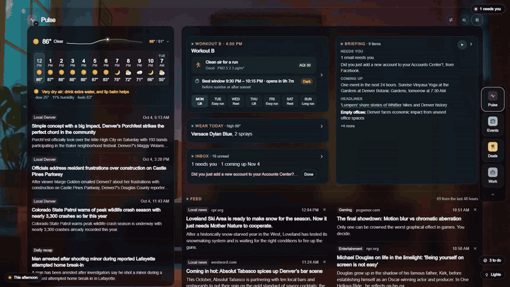
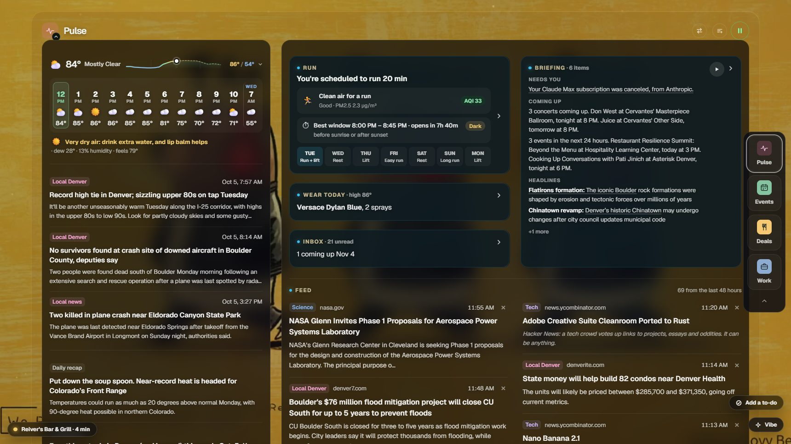
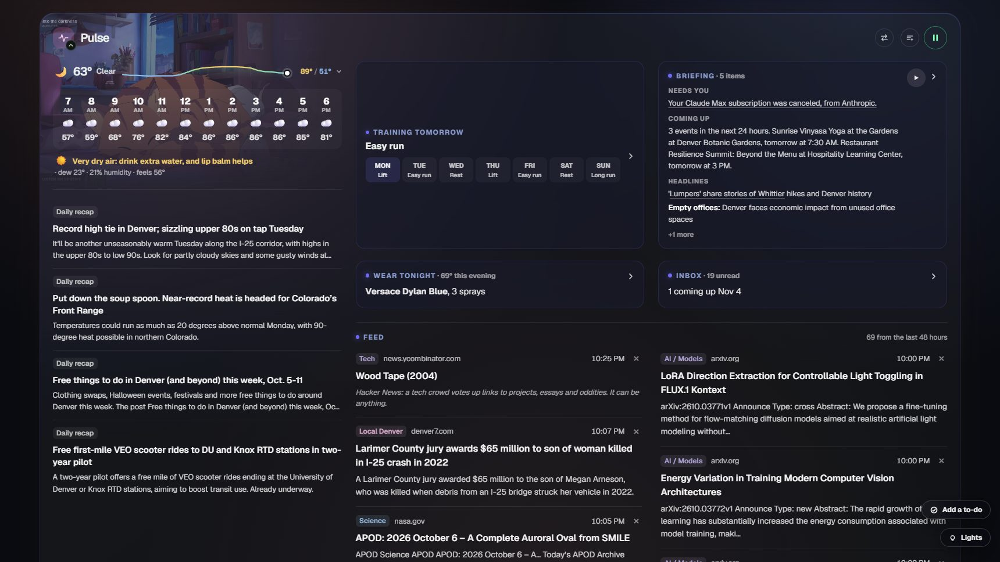

# Pulse Ops

Pulse Ops was formerly named **Levi Ops**. This repository is the sanitized public mirror. This README describes
the app as it runs today (2026-10-05); the code in this mirror is an older sanitized snapshot, so files the text names
may be missing here, and hostnames, user paths and account identifiers are replaced with placeholders.

For ongoing work with ChatGPT or Codex, follow [AGENTS.md](AGENTS.md).

A personal operations dashboard. One page brings together the things Levi checks every day: the morning Pulse (weather,
training, news, email, what scent to wear, music), Denver events and his own calendar, local food deals, and work (the
Uber driving log and science and geospatial job leads). Most of this data is collected by the
[Pulse Agent](https://github.com/LeviKCarter/pulseagent-public) automation queue.

It's a Next.js App Router app built with [vinext](https://www.npmjs.com/package/vinext) (Vite), React 19 and Tailwind 4.
The canonical copy runs on Levi's PC at `:3000`. Phones reach that copy over Tailscale, in the browser or through
[Pulse Mobile](#pulse-mobile-android-app), the sideloaded Android app.

- [What it looks like](#what-it-looks-like)
- [The four lanes](#the-four-lanes)
- [Where it runs](#where-it-runs)
- [Where the data comes from](#where-the-data-comes-from)
- [Keyboard shortcuts](#keyboard-shortcuts)
- [Setup](#setup)
- [Working on it](#working-on-it)
- [Local API routes](#local-api-routes)
- [Voice: run briefing, spoken topics and questions](#voice-run-briefing-spoken-topics-and-questions)
- [Claude connector (MCP)](#claude-connector-mcp)
- [Pulse Mobile (Android app)](#pulse-mobile-android-app)
- [Extras](#extras): Chrome extension, public preview, Block Filter sync
- [CI](#ci)

## What it looks like

Captured from the live dashboard on 2026-10-05, 1720 px wide on the PC and 390 px on the phone.

**The wallpaper** (F). The music video fills the screen. The clock, the weather and what's playing sit on the left;
the music player, the lane icons, the Now thought and the Mail, To Do and Lights pills sit on the right.


**Wheel down for the feed, a key for a lane.** The wheel slides the feed in. W and E open Events and Deals as one
pane beside it, and Esc puts everything away.


**A story opens in place.** It grows out of the feed's lane, V and B scroll it, and Esc shrinks it back.


**Three views.** F switches between the wallpaper and the hybrid view (all four lanes as glass over the video). M
switches the hybrid view to the classic dashboard and back.



| The hybrid view (the PC default) | To Do pinned open (4) |
|---|---|
|  |  |

| Events beside the feed (W) | Deals beside the feed (E) |
|---|---|
|  |  |

| The classic dashboard (M) | The key list (?) |
|---|---|
|  |  |

**On a phone.** It starts on the wallpaper, as bare as the PC's: the clock and one line of weather with the day's
temperature graph at the bottom left. The Now card is a short scroll below. The four buttons at the top open the lanes.

<p>
  
  
</p>

## The four lanes

The lanes are **Pulse, Events, Deals and Work**. On a PC the default hybrid Vibe view lays them out as glass over the
music video. **M** switches between this and the classic dashboard. **F** opens the bare wallpaper with the clock,
weather, music and the Now card; its setting survives reloads. On the primary monitor the lanes read Pulse, Events,
Deals, Work, and Q/W/E/R follow that order. **Shift+F** mirrors the lanes, and their keys with them, for a monitor on
the other side of the desk; the choice is kept per screen.

On the wallpaper (1200 px or wider) the lanes are a row of icons under the music player: Events, Deals, Work and
**Brief**, which opens the daily briefing over the Now card. An icon or its key opens the lane as one pane over the
wallpaper. The same icon or key closes it, another one swaps it, and Esc or the mouse's Back button closes it. Wheel
down anywhere on the wallpaper slides the feed into the middle of the screen; wheel up from its top, or Esc, slides it
back out. From 1700 px the clock stays beside the feed, and an open lane sits between the feed (docked at the left
edge) and the Now column. Narrower than that, the lane takes the feed's place. Wheel up from the top closes an open
lane and the feed beside it.

Pulse has no pane on the wallpaper, because its pieces already live there: the weather and the scent pick under the
clock, mail in the Mail pill, the stories in the feed, the briefing behind Brief, and the workout in the Now card. Its
key brings the feed up and puts it away. Under 1200 px there is no feed over the wallpaper, so Pulse keeps its icon
and pane. A story opened from the feed is not a pop-up: it grows out of the feed's lane to fill the room up to the
Now column, and Back (the button, Esc, or the mouse's Back button) shrinks it into the lane again.

A phone starts on the full-screen Vibe wallpaper, which shows off the video like the PC's: the clock is bare text at
the bottom left, and the weather is one line (an icon, the temperature, the day's temperature graph, the high and
low). The Now card with its thought starts just below the fold, so a short scroll shows it. Four touch buttons at the
top open the lanes over the wallpaper, and the music bar sits along the bottom with the Mail and To Do pills above it.
Closing a lane or using Back returns to the wallpaper; a swipe down closes it too. A lane always opens at its header.
A swipe up scrolls to the Now card, and the same swipe carried on past it slides the feed up as a sheet; one swipe
down puts it away. A saved classic view
keeps the phone overview. The Now card's play button is available on phone and PC. It reads the card's current
content aloud using the saved feed voice; press again to stop.

In the Vibe views,
the **Now** card brings forward an event within 90 minutes, the workout around its planned start,
tomorrow's session after 9 PM, or the morning rundown. **I’m hungry** brings in food choices, ranked from a fresh
device location or recent Tasker phone fix; no nearby restaurant is guessed when location is unavailable.
**What should I do right now?** requests a fresh, quick contextual answer. **Another** skips the current recommendation
for 90 minutes, including other offers from the same restaurant, starts the conversation over and asks for a more
considered answer with a compact explanation (it replaced the separate Think deeper and New thought buttons). **I ate / I’m done** clears the current request. Hunger also expires after 90 minutes.
Choices are saved on the local server and shared by PC and phone. Patterns across at least three different days at
similar times and in the same area can favor food or deeper answers; repeated restaurant dismissals lower that
restaurant's rank. An imminent calendar commitment keeps priority. This is separate from the disabled music/Hue
habit learners. Distances use the existing approximate venue locations, not route or travel times.
During the scheduled run window, Now shows the planned duration, heart-rate zone and walk threshold, weather,
and the last recorded run's time, distance, pace and average heart rate. Recent distance, pace and run-only heart-rate
graphs appear as history becomes available; before the first run, the card shows the targets and an empty-history message.
Body-composition and mixed workout heart-rate charts remain in the morning rundown and training panel.
Load sparklines sit beside lift targets when the health brief carries enough history. The Now card uses an aligned
header, content and action grid, with hidden scrollbars while keeping wheel and touch scrolling available.
The bare wallpaper also shows how the weather feels, rain timing and the next 12 hours. On the PC's wallpaper the
thought is its own block under the lane icons, not part of the Now card: it rests a few lines tall and opens upward on
hover, with B or with the microphone, and Hungry / What now? / Another run along its foot while it is open. The Now
card there shows only the moment, and with no moment there is no card. The PC's wallpaper has no morning rundown
either, since everything in it is already on screen.
The Now card's thought sits under a heading that follows the moment (the run, an event, food, the time of day, or the
conversation once you speak). The **microphone** at the card's top corner makes the thought a back-and-forth: say
something (Chrome or Edge) and Pulse answers it from the same snapshot, with the thought and the earlier turns as
context. What was said and each answer are listed under the thought. Nothing is saved: the conversation lives in the
open page and **Another** starts it over. On a PC, **B** opens the thought (B again or Esc closes it) and holding **B**
is the microphone: what you say is sent when you let go. While B has it open, **1** is Hungry, **2** is What now? and
**3** is Another. The microphone needs a secure address (`localhost` on the PC, or https): on a plain-http LAN or
Tailscale address the browser refuses it, and the card says so.
A browser that opens the plain-http Tailscale address (`http://100.x.y.z:3000`) is sent to the https one that
`tailscale serve` publishes, set as `PULSE_HTTPS_ORIGIN` in `.env.local` (`app/secureAddress.ts`, `/api/secure-address`).
Pulse Mobile keeps the plain address: it loads it on purpose and has its own speech bridge.
Automatic checks share a thought for about 30 minutes; a new intent request gets its own answer, while retaining
the daily call limit and sharing the same request across devices. Deeper requests use the signed-in ChatGPT
CLI with **GPT-6.1 Sol**: the first two use **medium** reasoning and later requests **high**. Each request
re-reads the connected calendar, tasks and dashboard. Later requests add inbox summaries, more news and training history,
local events, job options, and the full text of up to four news articles. Food comes from the located, active shortlist,
respecting hunger and dismissed restaurants. The time window expands from 3 to 7,
14, 21 and 28 days, then caps at 30 days; the evidence allowance grows from 8,000 to 32,000 characters.
The source-details row shows which sources contributed and which were unavailable. Earlier thoughts travel with the
next request to avoid repetition. Progress is shared across devices, saved outside the repository in
`%LOCALAPPDATA%/PulseOps/now-thought-research.json`, and starts again each Denver day. Only successful manual thoughts
advance it. `NOW_THOUGHT_RESEARCH_FILE` overrides the state location for isolated previews.
Quick thoughts use the Anthropic API key when one is set, then the signed-in Claude CLI (Sonnet with thinking off,
about 5 seconds), then the signed-in ChatGPT CLI; `NOW_THOUGHT_PROVIDER` forces one of them
(`app/nowThoughtCli.ts`). Learned deeper answers use the established research
level. A new explicit deeper request advances it. A failed request shows a message; a changed intent or location clears
the previous answer so it cannot be mistaken for the new recommendation.

**1** opens Mail and **4** opens To Do. Mail appears above the Now card. **B** also opens the Vibe to-do list when it is not adding a selected event to Calendar or scrolling an open reader.
The list brings together tasks, bills, packages and upcoming calendar entries. While pinned open, 2/3 selects a row,
C completes the selected task, marks a bill Paid or a package received, and V opens its source in the reader panel.
In either list, 2/3 moves down/up, V views the selected source in the popout, and C completes it. Inside the source popout, 2/3 scrolls the content and C completes its item. Hovering the Inbox Supervisor or to-do pill opens it, moving onto its contents keeps it open, and clicking pins it.
The Mail pill is not drawn while nothing is waiting. The To Do list has an add box, and a to-do can also be spoken
("remind me to call mom tomorrow", "add milk to my to-do list") into the Now microphone or the ask box; it is saved to
Google Tasks without a model call. A new to-do shows at once as a pending row, and a slow Google Tasks read is
answered from the last list kept on the PC, so the list never waits on it. The **Lights** pill on the PC (and the Pulse header on a phone) has the Hue
controls for clicking.

| Lane | What's in it |
|---|---|
| **Pulse** | The 6:30 AM update and evening recap from Pulse Agent's `pulse_local.py`. Live weather and air quality for the phone's location, with a week forecast that opens automatically on days with rain, storms or snow. The training card (today's session, the week, lift targets, body composition). The collapsed home view shows a written summary of RSS and newsletter stories, plus unread newsletter highlights; opening it reveals the source links. The feed below is one list of stories, newsletter mail and Instagram posts, newest first, with no filters; each can be read in place, dismissed or (for mail) unsubscribed from. The briefing card reads the day aloud. The scent card (below). The music player. |
| **Events** | Upcoming Denver events from the Event Ledger, with 3/8/15 mi distance chips, a Free filter and categories. Can be overlaid with your own ICS calendars, Google Tasks (with a Done button), tracked-artist concerts from Songkick (a concert's ticket button opens the TicketData price comparison), and DoMORE tickets (claimed tickets, bonus and last-minute extras, the next drop, and clashes with your plans calendar). Events that the week's forecast says will get rained on are marked. Rows can be dismissed and restored. |
| **Work** | Two tabs. **Driving** is the Uber log, with nothing typed in: earnings, hours, trips and pay per hour for the week, from the orders accepted in Uber Driver and its time online, both reported by [Pulse Mobile](#pulse-mobile-android-app). A status line shows whether Uber Driver is offline, online, on an offer or on a delivery. **Careers** is the science and geospatial roles from the job pipeline, grouped into a few areas, each with an application stage (Saved, Applied, Interviewing, …). Stages are shared between devices. A warning appears if the pipeline hasn't run in the last day. |
| **Deals** | Verified and recurring food deals, shown only while they're running (weekday, date range and happy-hour windows from the sheet) and while the restaurant is open: a place that is shut, or closing within 30 minutes, is left out, and one closing within the hour is marked. Rockies game-day deals show the day after a qualifying game, checked against MLB's Stats API. Also here: food emails that were moved out of the feeds card, the gear watch, and dismiss/restore. |

Some Pulse pieces need a little more explanation:

- **Feed.** One list of RSS stories, newsletter mail and Instagram posts, newest first. Mixed feeds sort by actual
  publication time, including timestamps from different time zones; mail is interleaved with stories rather than
  collected at the top. There are no source or topic filters. A story opens as the dashboard's own text and
  pictures (`app/articleBlocks.ts`); the original page is the fallback and one tap away.
- **Sales.** Clear sale subjects such as "Last chance to save on summer shorts" go to Sales even when Gmail has
  not labelled them Promotions. Sales and mail labelled Promotions stay out of the feed and feed summary.
  The phone overview's Deals card has a **Food / Sales** switch and previews the selected list; opening the lane
  keeps that selection, and returning or reloading remembers it.
- **Emails.** Routine mail is marked read in Gmail before it ever reaches the page. That covers stale sign-in codes,
  sign-in notices, policy and terms updates, surveys, win-back mail, and payments that went through. Anything that
  looks like real trouble (a locked account, a changed password, a suspicious sign-in, a failed payment) stays on the
  page and is flagged important. Every auto-dismissed email is logged to `~/.leviops/auto-dismissed-email.jsonl`.
  Fresh codes that can be extracted from the subject or snippet stay for 15 minutes. Tap the code to copy it and
  clear the email; if copying is unavailable, the code is selected for manual copying. The closed Inbox card shows
  up to three pressing emails with Copy, Seen, Paid or Done actions, and tapping a line opens that email. Mail refreshes
  every minute while the page is visible and when you return to it. Payment receipts and billing-change notices
  are kept out of Bills. The rules are in `app/personalEmail.ts`.
- **Physical mail.** USPS Informed Delivery notices appear in the Inbox Supervisor, grouped by their received day,
  with a mail-piece count and **Mark collected** action. Collection clears every notice behind that row; the Inbox
  card's **Collected mail · Review / undo** list can undo it, including notices collected before that control was added.
  2/3 selects physical-mail rows and C marks the selected row collected.
  Uncollected notices retain their original date after midnight. Tracked packages remain in Events.
- **Bills.** Every unpaid bill goes to Events: on its due day, today when overdue, or on the day it arrived when
  no due date can be found (labelled **no due date**). Bills stay out of the Inbox card and its spoken summary.
  Opening a bill reads its source email in the pop-up reader. Marking it Paid in Events or the Vibe to-do list
  makes it available under **Paid bills · Review / undo** in the Inbox card; Undo paid marks the thread unread again.
  The sample test bill is no longer injected into the live dashboard.
  Routine bank/account statements and ATM/cash withdrawal confirmations are excluded from the Inbox Supervisor,
  including its unread counts, quick actions and spoken summary. Bills remain visible in Events; failed
  transactions, fraud warnings and explicit requests retain their relevant alerts and actions. These display
  exclusions do not mark mail read.
- **Scent card.** Picks what to wear, and how many sprays, from the weather, the time of day and tonight's plans. It
  draws on the shelf you keep in the card and on Fragrantica's "when to wear" votes
  (`app/fragranticaCrowd.ts`). A new bottle's name is looked up on this PC's Ollama models,
  so the lookup is free.
- **Feed summary.** The closed card previews two stories on phones and five on desktop; tap it for the full summary.
  Story links are woven into the summary's own words. **Listen** generates a separate spoken news brief: a few
  connected paragraphs that group related coverage and highlight the most useful stories. It uses the local
  Ollama model by default, or the configured Claude provider, and caches the script for replay. While preparing,
  the button shows progress and can cancel playback. If the model is unavailable or its output fails validation,
  the voice reads a short paragraph fallback without section headings or topic labels.
  In expanded Pulse, the RSS/email feed sits directly under the workout and feed-summary cards.
- **Outdoors.** Off-season avalanche status, snow and river readings sit inside the weather dropdown. Active avalanche
  forecasts keep their visible Outdoors card.
- **Training and weather.** The workout card includes today's best run window, using weather, air quality, daylight
  and the personal calendar. This is a visual notice only; it does not flash or recolor the lights.
  It hides the row when the window has passed or its inputs cannot be read. The dew-point
  comfort line appears only when Pulse is expanded, including the phone's opened Pulse lane.
- **Music.** The picker groups **Daily moods** (Morning, Daytime focus, Café, Evening, Wind down) separately from
  **Genres & sessions**. Auto follows morning jazz from 7 AM, Chillhop from 11 AM, café jazz from 2 PM, downtempo
  from 4 PM, and Wind down from 9 PM until midnight. Wind down starts on soft sleep ambient, with calm space music
  and sleepy lofi alternatives. Before 7 AM, Auto uses morning jazz. Synthwave is a request-only genre for retro
  and night-drive music; the sleep-lofi stream is in Wind down. The other genre choices include deep focus,
  classic rock, indie, house, classical, reggae, funk,
  drum & bass, ambient, and blues. Pick them by chip or say, for example, "play drum and bass", "play ambient", or
  "play blues". DnB, Ambient, and Blues each have two live streams. Click the selected chip again to cycle its streams.
  These extra choices are available by request; Auto follows the daily schedule.
  A YouTube embed: a slim control in the Pulse header on a PC, and a fixed strip at the top of the page on
  a phone. With no saved level it starts at 25% volume and picks a stream for the time of day. PC tabs share their
  volume; the phone keeps its own saved volume, mute setting, and play/pause choice. Reopening or refreshing a phone
  last left playing attempts to resume; a phone left paused stays paused. If the browser requires a gesture to
  resume audio, the next tap retries it. A first visit waits for Play, and temporary pauses for other audio do not
  overwrite the saved choice. The dashboard takes on the
  colours of the video that's playing. The keyboard's Play/Pause key works as soon as the page is open. Voice commands can drive it
  too (see `app/musicRemote.ts`). On a phone the
  music keeps playing with the screen locked: this PC fetches the stream's audio with yt-dlp and ffmpeg and sends the
  phone a plain MP3 stream (`app/audioRelay.ts`, `/api/music/audio`), with Play/Pause/Next and
  the stream's picture on the lock screen. Tap Play to start it on the first visit. yt-dlp and ffmpeg live in a venv at
  `C:\Users\YOU\Documents\Codex\PulseOps-tools\media-relay` (setup in `app/audioRelay.ts`), and yt-dlp updates
  itself daily. The relay retries brief upstream network failures and times out silent reads after 15 seconds.
  The PC also replaces ended, failed or silent audio sources inside the same MP3 response, refreshing the upstream
  URL with up to five consecutive retries. This recovery does not depend on background phone timers. The moving
  backdrop pauses while the page is hidden, and resumes on return.
  The phone checks playback progress every five seconds; after 30 seconds without progress it reopens the stream
  with a fresh upstream URL, including while hidden when the browser permits timers. Returning to the page or
  reconnecting the network also checks for a stuck stream. Recovery is bounded to five retries; Play starts a new
  attempt, and intentional or temporary pauses cancel pending recovery. If the relay can't start, the phone falls back to YouTube's player, which pauses while the screen is
  locked and starts again when you're back (`app/backgroundPlay.ts`). Behind the page the phone
  plays a 10-second, 720p, 15 fps loop cut from the stream (made once per stream on this PC and kept in the venv's `loops`
  folder), instead of the full video that used to crash it. In Vibe the muted wallpaper loop can play before audio
  starts; Play/Pause still controls the music independently, and the loop pauses while the page is hidden.
  In Pulse Mobile the phone's music plays only over Bluetooth: off Bluetooth, Play holds with a note instead of
  starting; Bluetooth dropping mid-song pauses the music, and its return within 30 minutes picks it up again. In a
  browser the output is unknown and music plays as before.
- **Hue lights.** H switches music colours on at the remembered strength, steps through the video's colour sets on
  each further press, then switches them off; Shift+Z / Shift+X adjust that strength in 5% steps without resetting
  brightness. Z / X dim or brighten the lit rooms 5 points a press (hold to keep going).
  A third mode, Breathe, drifts the lights very slowly from one of the video's color picks to the next, about three minutes each,
  for as long as it is on; in Dominant and Contrast the colors are painted once per stream and J takes another pick.
  The modes stay available while a frame loads. Contrast pairs the dominant hue with a distinct hue from
  the frame, or its complementary color when the scene has only one color or closely related hues. Music colours switch
  in about 1 s, including stream changes, scheduled music-colour updates and restoring colours when switched off. The plain
  time-of-day dimming schedule keeps its gradual two-minute fade. A playing tab supplies the colours (PC preferred among
  players); a paused tab cannot override it. A fresh frame at the stream's live edge is sampled on each stream switch and every
  minute, and successful identical colours are not re-sent. The five-minute dimming task captures that playing
  stream's current frame itself before adjusting music colours, sharing samples for at most 30 seconds; if none is
  available, it leaves the lights as they are instead of repainting
  the saved palette from an earlier stream. Fixed-colour CLI flashes still hold their requested colours.
  The dimming schedule, a stream change and turning music colours off all leave
  manually changed brightness or bulb colours alone until the room is switched off or G resets it to the time-of-day
  default. Turning music colours off otherwise restores the saved bulb colours while keeping the current brightness.
  Reloading the dashboard refreshes enabled music colours from a current frame, even if audio starts paused.
  Returning to the window refreshes its frame and player check-in. The local server also refreshes enabled colours
  on player check-ins about once a minute, so updates keep working with the page in the background.
  The playing tab still takes priority over a paused tab, and manual room overrides remain respected.
  While a concert act plays, the page's tint, the wallpaper's light and the Hue lights follow the act's video or
  album art instead of the paused station, and go back to the station afterwards.
- **Phone directions.** Tap a deal in the phone overview, or its restaurant name in the Deals lane, to open Google
  Maps. A deal tied to a street address requests driving navigation; a chain-wide deal opens a search so you can pick
  the right branch. Home is `HOME_POINT` in the PC's `.env.local` (never in tracked code).
  **Drive Home** appears when the phone reports that it is more than a quarter mile away, or when its current location
  is unavailable. Google Maps controls whether it starts navigation immediately and whether a floating navigation
  view appears after you leave Maps.
- **Phone alerts.** Open the Pulse header's controls → **Phone alerts** → **Set up alerts**. This saves a random
  ntfy topic on the PC without editing `.env.local` or restarting the server. Install the ntfy Android app with
  **Install ntfy**, tap **Connect this phone**, allow notifications, then return and use **Test notification**.
  Manual subscription shows the same server and topic if the app link cannot open. A successful test means ntfy
  accepted the message; check the phone for receipt. The existing security-email alerts use this topic, the same
  40-per-day cap and 24-hour email-id deduplication. These alerts are triggered when the dashboard reads security
  mail; this does not add a background inbox-monitoring worker.
  Setup lives in `%LOCALAPPDATA%\PulseOps\phone-alerts.json` (or `~/.leviops/phone-alerts.json` without LOCALAPPDATA),
  outside the repository and deployment checkout. Existing `NTFY_TOPIC` / `NTFY_SERVER` environment settings keep
  precedence; `PHONE_ALERTS_FILE` optionally overrides the runtime file. Setup reuses an existing topic and never
  rotates it. Keep the topic private: anyone who knows it can read or publish alerts. The local-only setup API
  returns subscription details with `no-store`; public copies cannot access it.

After a deploy, an open tab reloads itself onto the new build (`app/BuildWatcher.tsx`). It waits
while you're typing or music is playing.

## Where it runs

| Where | Reached by | What works |
|---|---|---|
| **Local server** (`vinext start` on `:3000` on the PC) | `localhost`, the LAN, or Tailscale (MagicDNS names, `*.ts.net`, `100.64.0.0/10`, `fd7a:115c:a1e0::/48`) | Everything |
| **Published copy** (Cloudflare, `pulse-ops-center.levikcarter.chatgpt.site`) | The public web | The page and the live feed. The local-only routes refuse requests, so the page falls back: dismissals and stages are saved in the browser only, weather is a fixed central-Denver Open-Meteo forecast, and there's no mail, calendar or music |
| **Public preview** (Cloudflare Pages, `pulseops-public-preview.pages.dev`) | The public web | A static build filled with invented data. See [`public-preview/README.md`](public-preview/README.md) |

## Where the data comes from

```
 Sheet store in Postgres (queue, food, events, jobs)  Things on this PC
        |                                           (phone location, Gmail via gws, ICS calendars,
        |  scripts/refresh_snapshot.py               Google Tasks, DoMORE, scent shelf, job stages)
        |  (every 15 min, via PulseAgent's local_sheets)                    |
        v                                                     v
 app/queueSnapshot.ts ── the page renders from it      app/api/* local-only routes ── the page calls them
        +
 'Site Snapshot' tab ── scripts/push_live_snapshot.py ──> Cloudflare Worker + KV (edge-feed/)
                        scripts/push_private_digest.py ──>   /snapshot  (public, read-only; the page polls it)
                                                             /private   (read only by the private MCP endpoint)
```

- **`app/queueSnapshot.ts` is generated.** Don't edit it by hand or commit it. Run `npm run refresh:snapshot` to
  regenerate it. If you change its types, change the template in `scripts/refresh_snapshot.py` as well. Run from any
  folder except the live one, the script only rewrites that folder's copy (for previews), and prints
  `SITE_SNAPSHOT_SKIPPED_NOT_LIVE_FOLDER` / `LIVE_FEED_PUSH_SKIPPED_NOT_LIVE_FOLDER`.
- **The private dashboard streams current Postgres data.** `/api/dashboard-feed` shares one read-only database reader
  across connected devices and sends an initial state followed by only changed sections. It checks database activity
  every two seconds, refreshes time-dependent status at least once a minute, and sends small connection heartbeats.
  Hidden tabs close their dashboard stream; reopening reconnects with current state. If streaming is unavailable,
  the browser reads the same local data every 15 seconds. This path does not wait for the scheduled snapshot or call
  Cloudflare. The scheduled snapshot still supplies startup data and the sanitized public feed.
- **Phone features load when needed.** Desktop wallpaper panels, voice, keyboard help, phone lights and alert setup
  have separate downloads. Paused phone music does not create an audio player, warm the relay or load its backdrop
  until playback is requested; a saved playing preference still resumes. Weather detail content mounts when opened.
- **`edge-feed/`** is the `levi-ops-live-feed` Cloudflare Worker. `/snapshot` is read-only, has an allowlisted schema
  and only allows the published site's origin (CORS). Local copies read it through the same-origin `/api/live-feed`
  proxy. The Worker also hosts the [Claude connector](#claude-connector-mcp) and the scent-shelf command queue.

## Keyboard shortcuts

These live in `app/hotkeys.ts`, and **?** shows the list on the page. Keys are ignored while you're
typing in a field or holding Ctrl, Alt or ⌘.

| Keys | Does |
|---|---|
| Q W E R | The four lanes, left to right as laid out: Pulse, Events, Deals, Work on the primary monitor (Work, Deals, Events, Pulse on a screen laid out the other way; Shift+F switches). On the wallpaper the Pulse key brings the feed up and puts it away |
| A / S | Music volume down / up |
| D | Next music stream (cycles Auto's picks for the current block); the next song and visual while a concert act plays |
| Shift+D | Previous music stream, wrapping at the ends; the previous song and visual while a concert act plays |
| Space / T | Play or pause music |
| F | Open / close the bare Vibe wallpaper; its setting survives reloads |
| M | Switch the default hybrid view off / on |
| Shift+F | Flip the lane order |
| B | Open the Now card's thought (B again or Esc closes it); hold B to talk to it, sent when you let go; while open, 1 / 2 / 3 are Hungry / What now? / Another. With a reader or picked event, B keeps its job below; in the classic dashboard it asks out loud like Tab |
| Tab | Ask the dashboard out loud; press Tab again to stop (`app/VoiceAsk.tsx`, Chrome/Edge speech-to-text + `/api/ask`) |
| 1 | Open / close Mail (Inbox Supervisor), above Now |
| 2 / 3 | Move down / up the active Mail or To Do list; scroll down / up inside the source popout. Elsewhere, step through the feed, the Inbox rows, the events (or DoMORE extras) or the deals, whichever is open |
| 4 | Open / close To Do. With Events open: hide / show concerts |
| 5 | Read the daily briefing aloud from any view (again to stop) |
| V / B | Scroll the open story or email down / up; hold for a steady glide. In Events, V on a picked concert plays the act's songs and pauses the music, V on any other event opens it in the reader, and B adds the picked event to Calendar. In Deals, V opens the picked deal's details or email. V opens a selected Mail or To Do row's source |
| Shift+V / Shift+B, + / − | In an open email or story: zoom the text in / out (0 resets) |
| C | Complete the selected Mail or To Do item, including from its source popout (email seen, mail collected, task done, bill paid, package received). Elsewhere, the one action for what is open or picked: mark the story read, unsubscribe from or dismiss the email, mark a task done, claim the picked DoMORE extra, hide the picked deal |
| H | Switch the Hue lights' music colours on at the remembered strength, then step through the modes (Dominant, Contrast, Breathe), then off |
| J | While the lights have the video's colours: another pick of them |
| Z / X | Dim / brighten the lit Hue rooms by 5 percentage points; hold to keep stepping |
| Shift+Z / Shift+X | Decrease / increase music-colour strength in 5% steps up to 100% |
| G | Reset Hue lights to the time-of-day default, ending music colours and manual overrides |
| ? | Show the key list |
| Mouse Back / Forward | Back closes whatever is open, as Esc does. Forward opens the next email |
| Esc | Close a panel or the help list, or leave the bare wallpaper; on a lane over the wallpaper it closes the lane and the feed beside it |

## Setup

You need Node 22.13+ and a Pulse Agent checkout on the same machine, because the local routes run its Python scripts.

```bash
npm install
npm run dev        # dev server; file-backed routes (job stages, scents) need `npm run build && npm run start`
```

Local settings go in `.env.local`, which is gitignored. All of them are optional:

| Variable | Default | Purpose |
|---|---|---|
| `FOOD_DISMISS_DIR` | `C:\Users\YOU\Documents\Codex\PulseAgent` | Pulse Agent checkout that the local routes run scripts from and keep data in |
| `FOOD_DISMISS_PYTHON` | `C:\Users\YOU\miniforge3\python.exe` | Python used to run those scripts |
| `JOB_STAGES_FILE` | `<PulseAgent>\data\leviops_job_stages.json` | Shared job-stage store |
| `SCENTS_FILE` | `<PulseAgent>\data\leviops_scents.json` | Scent shelf (bottles, run-outs, days worn) |
| `CONCERT_DISMISS_FILE` | `<PulseAgent>\data\leviops_concert_dismissals.json` | Dismissed Songkick concerts |
| `TASKER_LOCATION_FILE` | `G:\My Drive\Tasker\location` | Phone location, used for the forecast and distance chips |
| `PERSONAL_CALENDAR_ICS_URLS` | unset | Your ICS calendar feeds for the Events overlay |
| `PERSONAL_TASKS_URL` | unset | Web-app URL of [`scripts/google-tasks-feed.gs`](scripts/google-tasks-feed.gs); setup steps are in the file header |
| `PERSONAL_EMAIL_URL` | unset | Optional web-app URL (with `?key=`) of `scripts/gmail-feed.gs`. If unset, mail is read through Pulse Agent's `gws` sign-in (`scripts/gmail_feed.py`) |
| `DOMORE_AUTH_TOKEN` | unset | DoMORE member-app sign-in token for the tickets overlay. It stops working when DoMORE signs you out |
| `ASK_PROVIDER`, `ASK_MODEL` | `ollama`, `qwen3:8b` | Where `/api/ask` gets its answers. The default is the local Ollama model (free, no key). `ASK_PROVIDER=claude` uses the Claude API instead |
| `ANTHROPIC_API_KEY` | unset | Needed for `ASK_PROVIDER=claude` (each question is billed; capped per minute and per hour). When set, quick Now thoughts also use it first |
| `NOW_THOUGHT_PROVIDER` | unset | Forces the Now thought onto one provider: `cli` (signed-in Claude CLI), `codex` (signed-in ChatGPT CLI), `claude` or `openai` (API keys). `NOW_THOUGHT_CLAUDE_PATH` / `NOW_THOUGHT_CODEX_PATH` point at the CLIs when they aren't found |
| `HOME_POINT`, `HOME_ADDRESS` | unset | Home as `lat,lon` (and an optional address) for Drive Home |
| `PULSE_HTTPS_ORIGIN` | unset | The https address `tailscale serve` publishes; plain-http Tailscale visitors are sent there so the microphone works |
| `EIA_API_KEY`, `GAS_PRICE`, `UBER_MPG` | unset | Grading Uber offers: the EIA's weekly Denver gas price (or a fixed `GAS_PRICE`) and the car's mpg |
| `GH_PATH` | `gh` | GitHub CLI that `/api/mobile-update` uses to read the Pulse Mobile release |
| `NTFY_TOPIC`, `NTFY_SERVER` | unset | Phone alerts through ntfy; normally set from the page instead (see Phone alerts) |
| `CALL_CAP_<PROVIDER>` | see `docs/outside-calls.md` | Overrides one outside provider's daily call cap (`0` blocks it) |
| `OLLAMA_URL`, `SCENT_TEXT_MODEL`, `SCENT_VISION_MODEL` | `http://127.0.0.1:11434`, `qwen3:8b`, `qwen3-vl:8b` | Local models used for scent lookups |
| `AWS_ACCESS_KEY_ID`, `AWS_SECRET_ACCESS_KEY`, `AWS_REGION` | unset, unset, `us-east-1` | Switches the feed summary card's listen button from the free Microsoft neural voices (no key) to Amazon Polly (`app/api/feed-speech`); billed per character. Unset, it uses the free Microsoft neural voices, then the browser's own voice if those fail |
| `SPOTIFY_CLIENT_ID`, `SPOTIFY_CLIENT_SECRET` | unset | Optional extra, not needed. V finds an act's Spotify page through MusicBrainz (free, no key) and plays it in a small in-page player (full tracks when signed in to Spotify in the browser, 30-second previews otherwise); these two keys from a developer app are only tried when MusicBrainz has no Spotify link for the act (Spotify's Web API needs the app owner to have Premium) |
| `POLLY_VOICE` | `Matthew` | Polly voice used for the listen button |
| `POLLY_ENGINE` | `generative` | Listen-button speech engine; falls back to neural for an unsupported engine/voice/region. Set `neural` to use it directly |
| `MUSIC_RELAY_PYTHON`, `MUSIC_RELAY_FFMPEG` | `<PulseOps-tools>\media-relay\Scripts\python.exe`, auto-detected | Python with yt-dlp and imageio-ffmpeg, and optional explicit ffmpeg path for phone audio and backdrop loops |
| `HUE_BRIDGE_IP`, `HUE_APP_KEY`, `HUE_ROOMS` | unset | Hue bridge and pairing key; optional comma-separated room names. Setup is in `scripts/hue_dim.mjs` |
| `SITE_ORIGIN` | `http://localhost:3000` | Base URL for page metadata |

State the server keeps outside the repo lives in `%LOCALAPPDATA%\PulseOps` (Now choices and research progress, the
work log, Uber offers, phone location, phone alerts, Block Filter sync, Instagram pictures, artist genres). Each file
has an override for isolated previews and tests: `NOW_INTENT_FILE`, `NOW_THOUGHT_RESEARCH_FILE`, `WORK_LOG_FILE`,
`UBER_OFFERS_FILE`, `PHONE_LOCATION_FILE`, `PHONE_ALERTS_FILE`, `BLOCK_SYNC_FILE`, `ARTIST_GENRE_FILE`. The ones kept
in the Pulse Agent checkout's `data` folder have `DEAL_STORES_FILE`, `HABIT_LOG_FILE` and `SCENT_SHARE_DIR`.

`refresh_snapshot.py`, `push_live_snapshot.py` and `push_private_digest.py` read the sheets through PulseAgent's
`pulseagent_core.local_sheets` (the control-plane Postgres) and the Worker's write token from `%LOCALAPPDATA%\PulseAgent\`.

## Working on it

Several coding-assistant sessions work on this repo at the same time, so **every change is made in its own git worktree, never in
the live folder**. [`CLAUDE.md`](CLAUDE.md) has the full workflow.

For interface changes, read `PRODUCT.md` for the product context and `DESIGN.md` for
the design system. Impeccable is configured to build directly in code, with Live Mode targeting `app/layout.tsx`.

1. `powershell -File scripts\new_worktree.ps1 -Name <task>` creates `..\PulseOps-worktrees\<task>` from `github/main`,
   with `node_modules` linked to the live folder's and `.env.local` copied in. Preview on a port other than 3000.
2. Commit, push, and open a PR that's ready for review (not a draft). [`auto-merge.yml`](.github/workflows/auto-merge.yml)
   squash-merges it once CI passes.
3. The **Pulse Ops Deploy Poll** scheduled task notices the new `main` within a minute and runs `scripts\deploy_live.ps1`.
   That script moves the live folder to `main`, refreshes the snapshot, builds, restarts `:3000` (Pulse Agent's
   web-services supervisor brings it back up) and prints `DEPLOY_OK <sha>`. The log is `scripts\deploy_poll.log`.
4. `powershell -File scripts\remove_worktree.ps1 -Name <task>` cleans up. Don't delete a worktree folder by hand:
   deleting through its `node_modules` link would wipe the live folder's modules.

| Command | Does |
|---|---|
| `npm run dev` | Dev server |
| `npm run build`, `npm run start` | Production build, and the Node server that the live dashboard runs |
| `npm run lint` | ESLint |
| `npx tsc --noEmit -p .` | Type check (the build doesn't type-check) |
| `npm test` | Unit tests with Node's built-in runner (the `scripts/*.test.mjs` files listed in `package.json`; a new test file must be added there): spoken text, `/api/ask`, music commands, email rules, scents, event clashes, job areas, hotkeys, the Now card, the wallpaper feed, the work log, the Worker's MCP, private-digest, shelf and ingest code, and Pulse Mobile's offer logic when a JDK is present |
| `npm run refresh:snapshot` | Regenerate `app/queueSnapshot.ts` from the sheets |
| `npm run build:public-preview` | Sanitized static build filled with invented data |
| `npm run publish:handoff` | Refresh, build, lint and package a hashed bundle in `handoff/` for publishing |

## Local API routes

Everything under `app/api/` except `live-feed`, `rockies` and `build-id` answers only local hosts (localhost, the LAN,
Tailscale). `block-sync` checks for its `x-block-filter` header instead.
The routes that change something also refuse cross-origin requests. Every server-side call to an outside service asks
`app/callBudget.ts` first; the caps are listed in `docs/outside-calls.md`.

| Route | Does |
|---|---|
| `food-dismiss`, `events-dismiss` | Dismiss, restore or list dismissed rows in the sheet, using Pulse Agent's `food_dismiss.py` / `events_dismiss.py` |
| `concert-dismiss` | Dismiss or restore a Songkick concert |
| `job-stages` | Read and write the shared job-stage file |
| `scents`, `scents/identify`, `scents/share` | Read and write the scent shelf; look a bottle up by name or photo on the local models; take a bottle photo from the phone's Share sheet |
| `deal-stores` | The Sales tab's muted, pinned and shop-here stores, kept on the PC so the briefing follows them |
| `shelf-command` | Run one scent-shelf change for the Claude connector (called by `scripts/poll_shelf_commands.py`) |
| `forecast` | Open-Meteo weather + air quality for the phone's location (`app/openMeteoEnvironment.ts`, one shared reading per 5 minutes via `app/environmentReading.ts`). `?detail=1` returns the week of hours |
| `origin` | Phone location, rounded to about 1 km, for the distance chips |
| `phone-location`, `now-location`, `home` | Pulse Mobile's background location in; the freshest location for the Now card; the Home point |
| `outdoors` | The Outdoors card: CAIC avalanche forecast, Front Range snow, USGS river flows and weather or park alerts |
| `personal-calendar`, `personal-tasks` | Your calendars, Google Tasks and DoMORE overlay, and marking a task done |
| `personal-email` | Unread Gmail for the feeds card: read a thread's body, mark read/unread, unsubscribe, list auto-dismissed mail |
| `instagram`, `instagram/image` | Instagram posts handed over by Muse, as feed rows; the PC's saved copy of each picture |
| `rss-article` | A story's page as text and pictures for the reader |
| `now-thought`, `now-intent` | The Now card's thought and conversation; its Hungry / Another / I ate choices |
| `notify`, `notify/setup` | Send a phone alert through ntfy; set the topic up from the page |
| `work-log`, `uber-offer` | The Uber driving log; grade an Uber Driver offer for Pulse Mobile |
| `mobile-update` | The newest Pulse Mobile build, read with the PC's `gh` |
| `block-sync` | The Block Filter's shared list (see Extras) |
| `secure-address` | The https address a plain-http Tailscale visitor is sent to |
| `habit-log`, `habit-summary` | Log of music, light and like choices, and how well the habit predictors match it (they run in shadow; applying them is off) |
| `music/remote`, `music/still` | Player command mailbox and shared stream, Hue colour strength and PC volume; same-origin thumbnail for the page's colours |
| `music/genre`, `music/visuals`, `spotify` | A concert act's genre (iTunes, MusicBrainz), its visuals (a muted music-video loop, else album art) and its Spotify artist id for the in-page player |
| `music/audio`, `music/loop` | PC-relayed MP3 audio and cached backdrop loop for the phone |
| `hue-dim` | Read light state, adjust brightness or music colours, restore colours, or reset to the schedule |
| `run-window` | Today's best run window from weather, air quality, daylight and personal plans |
| `feed-digest`, `feed-briefing`, `feed-speech` | Linked written feed summary, narrative spoken brief, and neural voice audio for Listen |
| `briefing` | The daily briefing (the calendar, what needs you, what is coming up) shown behind Brief and read by 5; the card adds headlines from its feed digest. Calls no model |
| `live-feed` | Same-origin proxy for the Worker feed. Works on any host |
| `dashboard-feed` | Private Postgres-backed event stream; `?snapshot=1` returns the complete current state |
| `run-briefing`, `voice`, `ask` | Spoken text (see below) |
| `rockies` | Yesterday's Rockies result, for game-day deals. Works on any host |
| `build-id` | The build the server is running, for `BuildWatcher` |

## Voice: run briefing, spoken topics and questions

All three routes send back sentences that can be read aloud. Add `&format=text` to get plain text instead of JSON. Phones
reach them over Tailscale. Test a URL in phone Chrome first, for example
`https://YOUR-PC.YOUR-TAILNET.ts.net:8443/api/voice?q=weather&format=text`.

### Morning run briefing (`/api/run-briefing`)

When you plug in headphones, Tasker speaks only what differs from a plain run day (a walk and why, a run to keep easy)
and what's next on the calendar, and then Spotify resumes. On a plain day with nothing coming up the
text is empty and nothing is said. The run-or-walk rules are in `app/runBriefing.ts`. It says walk when:

- the feels-like temperature is under 20 °F or over 88 °F
- the dew point is over 68 °F
- AQI is over 100 (moderate air above 50 is still a run, at an easy effort)
- rain is 60%+ likely within two hours
- the forecast has thunder, hail, ice or snow

If there's a timed calendar item in the next 75 minutes, it tells you to keep the run short.

### Spoken topics (`/api/voice`, free, read-only)

`?topic=` names a topic outright: `brief`, `rss`, `events`, `tasks`, `weather`, `workout` or `scent`. You can also send the
words you said as `?q=` or as a POST body, and the route picks the topic for you. If it doesn't recognise the words, you
get the brief. `&limit=N` sets how many stories or events it reads (3 by default, 8 at most).

| Say something like | Topic |
|---|---|
| "news", "headlines", "RSS" | `rss` |
| "scent", "cologne", "what should I wear" | `scent` |
| "events", "tickets", "what's on" | `events` (includes held DoMORE tickets and their clashes) |
| "tasks", "to-do list", "what's due" | `tasks` |
| "weather", "rain", "air quality" | `weather` |
| "workout", "should I run", "lifting" | `workout` |
| anything else, "good morning" | `brief` |

**The brief** covers, in order: your calendars and tickets, the next 24 hours of events,
tasks due, unread email, and the top two stories. It doesn't say the weather, the scent pick or the workout, and an
empty calendar, events list, task list or mailbox is left out; ask for those topics by name. The email line uses the
Inbox card's rules and says only counts and a day ("2 emails need you, 1 security alert and 1 has a date coming up on
Friday"), never a subject or a sender. If one part can't be reached, the brief
says so ("I couldn't reach your calendars") and reads the rest.

**Task "Ask Pulse Ops":** *Input > Get Voice* (Timeout 8, *Continue Task After Error* on) → *Net > HTTP Request* POST
`https://YOUR-PC.YOUR-TAILNET.ts.net:8443/api/voice?format=text`, Body `%VOICE`, Content Type `text/plain`, Timeout 30 →
*Alert > Say* `%http_data`, Stream Media. Errors come back as sentences too, so the task doesn't need a separate error
branch. You can start it from a home-screen shortcut, a headset media button, or right after the run briefing (add
*Say* "Anything else?" and *Perform Task* before *Media Control > Play*).

### Free-form questions (`/api/ask`)

This route answers anything the dashboard shows in one to three spoken sentences. It builds a digest of the dashboard
and sends it with the question to the model on this PC through Ollama (`qwen3:8b`): free, and no key. The first
question after a while waits for the model to load, which can take most of a minute. `ASK_PROVIDER=claude` sends it to
Claude (Sonnet 5) instead, which needs `ANTHROPIC_API_KEY` and is billed. Follow-up questions work for ten minutes,
and `&reset=1` starts over. The prompt and digest are in `app/askLevi.ts`; the provider choice is in
`app/askModels.ts`.

- **Music commands** ("pause", "louder", "play synthwave", "what's playing") run straight away without calling Claude,
  so they don't reach a model at all. Looser phrasing goes to the model, which has a music tool.
- **Scent shelf changes** ("add Dior Sauvage, a sample", "I ran out of CK One", "put CK One back") are tools that the
  model can use on POST only, never on GET. Dashboard text is treated as data, so a line planted in a scraped page can at
  worst add a bottle or mark one run out. The card's "All scents" list undoes either. The tools are in
  `app/askTools.ts`.

**Task "Ask Claude"** is the same as "Ask Pulse Ops" with these changes: Get Voice uses the Free Form language model, the
URL is `/api/ask?format=text`, the Timeout is 45 s, the request only runs if `%VOICE Set`, and an optional *Task > Goto*
loops back for another question. On the PC, **Tab** does the same from the page.

## Claude connector (MCP)

Claude (the app, including voice mode) can read the dashboard through a custom connector. This uses the Claude plan
rather than API credits. The MCP server runs on the same Worker (`edge-feed/src/mcp.js`) and
has two endpoints:

| Endpoint | Secret | Tools |
|---|---|---|
| `/mcp/<token>` | `MCP_TOKEN` | Read the snapshot: `get_training_plan`, `get_news`, `get_events`, `get_jobs`, `get_food_deals`, `get_system_status` |
| `/mcp-private/<token>` | `MCP_PRIVATE_TOKEN` | The six above, plus the private digest (`get_morning_brief`, `get_weather`, `get_scent`, `get_workout`, `get_my_events`, `get_tasks`) the scent shelf (`get_scent_shelf`, `add_scent`, `remove_scent`, `restock_scent`) and finds (`ingest_discovery`, `get_ingest_status`) |

- **The URL is the password.** A wrong token gets the same 404 as any unknown path. The full URLs are kept outside the
  repo, in `%LOCALAPPDATA%\PulseAgent\leviops-mcp-url.txt` and `leviops-mcp-private-url.txt`. Anyone with the private
  URL can read your calendar, tickets and tasks. To add the connector in Claude: Settings → Connectors → *Add custom
  connector*, paste the private URL, and leave OAuth empty.
- **The private digest.** After each snapshot push, `scripts/push_private_digest.py`
  reads this PC's `/api/voice` topics and posts them to the Worker's `/private`. They're kept in a separate KV key that
  no public route serves. Each answer says how old it is, and anything older than 90 minutes is flagged (usually the
  PC is asleep). **This puts your calendar, tickets and tasks in Cloudflare KV,** along with the brief's unread-email
counts (no subjects or senders). To stop it, remove the
  `push_private_digest()` call from `refresh_snapshot.py` and run
  `npx wrangler kv key delete private --binding SNAPSHOT --remote` in `edge-feed`.
- **Shelf edits.** The Worker can't reach the PC, so the edit tools queue a command on the Worker
  (`edge-feed/src/shelf.js`). The scheduled task **Pulse Ops Shelf Sync**
  (`scripts/register_shelf_sync_task.ps1`) runs
  `scripts/poll_shelf_commands.py`, which checks the queue every 10 seconds, runs
  each command through `/api/shelf-command` and reports the result back. Nothing on the PC listens for incoming
  connections. If the PC is off, commands wait up to a day. The log is
  `%LOCALAPPDATA%\PulseAgent\logs\leviops-shelf-sync.log`.
- **Finds (ingest).** A Claude chat that read something you follow (a sweep of your Instagram feed, say) can add what it
  found with `ingest_discovery`: events for the ledger, food deals, and local news stories, up to 12 / 10 / 10 per call.
  It rides the same queue-and-poll route as shelf edits (`edge-feed/src/ingest.js`, the
  Worker's `/ingest`): the same scheduled task hands each batch to Pulse Agent's `discovery_ingest.py`, which checks
  every item the way scheduled discovery does (an allowed category, not already started, no sports, not already
  listed, a link that loads) and writes the ones that pass, with *Found By* set to the source ("Instagram"). News
  stories are kept in `%LOCALAPPDATA%\PulseAgent\pulse\ingested_news.jsonl`, which the feed reads beside the RSS
  files. The tool answers with what was added and what was skipped, and why; `get_ingest_status` shows the same
  later. New rows reach the dashboard with the next snapshot (within 15 minutes). The chat's reading of a post is not
  re-verified beyond those checks, so a wrong date in a post is a wrong date in the ledger: dismiss it with the row's
  x. Post text is only ever stored as one clipped line per field; nothing in it is run.
- **Muse (Meta's agent).** Muse has no connector form: you ask it in chat to build a custom connector, and it asks for
  the key in its own secure prompt. So it gets a third entrance, plain `/mcp` with `Authorization: Bearer <key>`
  (secret `MCP_MUSE_TOKEN`), which offers the same sixteen tools as `/mcp-private`, so Muse can read your calendar,
  tickets and tasks and change the scent shelf (until 2026-10-05 it had the six snapshot tools only). The key is
  in `%LOCALAPPDATA%\PulseAgent\leviops-mcp-muse-key.txt`. Tell Muse: *"Create a custom connector for my Pulse Ops MCP
  server at `https://YOUR-WORKER.workers.dev/mcp`. It is a remote MCP server over streamable HTTP
  (stateless, POST only) and uses a bearer token in the Authorization header."* A wrong key gets 401; with the secret
  deleted the path is a 404 and Muse is cut off without touching Claude's connectors.
- **Instagram, through Muse.** Instagram has no API for a personal home feed, and Muse is Meta's agent, so Muse is the
  one thing that can read yours. Its entrance has one tool the Claude connectors don't: `submit_instagram_digest`, which
  takes up to 40 posts a call (account, caption, instagram.com link, picture link, time) and keeps them on the Worker for
  a week, each post once (`edge-feed/src/instagram.js`). Captions are stored as capped
  plain text, a link that isn't to instagram.com is dropped, and a picture is kept only as an https link to Meta's image
  servers (`*.cdninstagram.com`, `*.fbcdn.net`). A post sent again with its `imageUrl` gains the picture, and the tool
  tells Muse how many new posts came without one. `GET /instagram` with the write token reads them back; `/snapshot`
  and the connectors never serve them.
  On the dashboard the posts are rows of the Pulse feed, mixed in by time with stories and newsletters
  (`app/instagramFeed.ts`, `api/instagram`, local only). Muse cannot supply pictures (its
  Instagram tools return none for a feed post), so the PC asks Instagram for each post's link preview, the public
  oEmbed answer a chat app unfurls a pasted link with: one request per post, under the name `PulseOps-LinkPreview`,
  giving the preview picture and the caption in full (Muse's copy is cut short). A post from a private account has no
  preview and stays a caption. Meta's picture links are signed and stop working within days, and its servers won't
  show them inside another site's page, so the PC downloads each picture once into
  `%LOCALAPPDATA%\PulseOps\instagram-images` (cleared after 8 days) and the feed shows that copy
  (`api/instagram/image`). Opening a row shows the picture and the whole caption, with "Open on Instagram".
  Ask Muse: *"Read my Instagram home feed and send the new posts from accounts I follow to Pulse Ops with
  submit_instagram_digest, each with its post link."*
- **Mail, through Muse.** When the PC's own Gmail read fails, the Inbox falls back to the list of unread threads
  Muse last handed over with `submit_email_digest` (`edge-feed/src/email.js`,
  `app/museEmail.ts`). Muse has to be asked, or scheduled, to send it.
- **Rotating a token.** In `edge-feed`, run `npx wrangler secret put MCP_PRIVATE_TOKEN` (or `MCP_TOKEN`,
  `MCP_MUSE_TOKEN`), then update the connector and the URL or key file. Deleting the secret turns the endpoint off (404).
- **Testing locally.** In `edge-feed`, run
  `npx wrangler dev --local --var MCP_TOKEN:test --var MCP_PRIVATE_TOKEN:priv --var WRITE_TOKEN:seed`, POST a snapshot
  to `/snapshot` with `Authorization: Bearer seed`, then point an MCP client at `http://127.0.0.1:8787/mcp/test`.

## Pulse Mobile (Android app)

`mobile/android` is a sideloaded Android app that wraps the dashboard and adds what a browser tab
can't do:

- **The dashboard in a WebView**, loaded from the plain Tailscale address, with native speech standing in for the
  browser's. Links to other apps leave the WebView.
- **Background location** to `/api/phone-location`, for the forecast, the distance chips and the Now card.
- **Music only over Bluetooth.** The app tells the page whether Android's media sound goes to a Bluetooth output, so
  the phone's speaker never starts the music.
- **The Uber driving log.** It reads Uber Driver's notifications and, through a read-only accessibility service, its
  offer cards. Each offer is sent to `/api/uber-offer` and graded (`app/uberOffer.ts`: pay against
  time, distance, gas and how far the drop-off is from a busy area) and shown as a Good / OK / Skip badge; time or
  distance it could not read is "not graded", never guessed. The badge is never silent: it says "Order grader on"
  when Android starts the service, "Grading..." the moment an offer is recognised, and "Can't reach the PC" at the
  first failed try. Accepted orders and time online go to the Work lane's
  log, each order once.
- **Updates in the app.** `/api/mobile-update` reads the newest release with the PC's `gh`, and the app installs it
  itself, because an install from the browser or Files switches the offer reader off.

`pulse-mobile.yml` builds the APK on any PR that touches `mobile/` and publishes
it as the `pulse-mobile` release. The signing key lives on the private `pulse-mobile-signing` release, never in git.
The phone's decisions are two Android-free classes (`OfferTracker.java`, `DriverLogic.java`) that `npm test` compiles
and runs when a JDK is present.

## Extras

- **`chrome-extension/`**: a small unpacked Chrome extension that pauses the music while
  another tab is playing sound and resumes it afterwards. It only sees which tabs are making sound.
- **[`public-preview/`](public-preview/README.md)**: builds a copy of the real UI with `app/api/` removed, the snapshot
  replaced by invented data, and the live feed cut off. It's deployed to Cloudflare Pages after every
  merge.
- **Block Filter sync** (`/api/block-sync`): the Block Filter browser extension on the PC and its phone userscript
  share one block list, muted communities and settings, kept on the PC in `%LOCALAPPDATA%\PulseOps\block-sync.json`.
  Nothing of it shows on the dashboard, and the extension's source is outside this repo.

## CI

- **Auto-Merge PRs** ([`auto-merge.yml`](.github/workflows/auto-merge.yml)): every PR runs `npm ci`, a type check,
  `npm test`, lint and `npm run build`. Non-draft PRs then squash-merge themselves. There's no human review step, so
  opening a PR is effectively merging it. A PR that changes a workflow file gets a comment explaining how to merge it
  if the auto-merge token can't.
- **Deploy public preview** ([`deploy-public-preview.yml`](.github/workflows/deploy-public-preview.yml)): runs on every
  push to `main`, which auto-merge dispatches for you, and can also be run by hand. It refuses to deploy if a Google
  Sheets link survived the sanitizing.
- **Pulse Mobile APK** (`pulse-mobile.yml`): builds and publishes the Android app
  on PRs that touch `mobile/`, and can also be run by hand.
