# Pulse Ops

Pulse Ops was formerly named **Levi Ops**. This repository is the sanitized public mirror. This README describes
the app as it runs today (2026-10-08); the code in this mirror is an older sanitized snapshot, so files the text names
may be missing here, and hostnames, user paths and account identifiers are replaced with placeholders.

For ongoing work with ChatGPT or Codex, follow [AGENTS.md](AGENTS.md).

A personal operations dashboard. One page brings together the things Levi checks every day: the morning Pulse (weather,
training, news, email, what scent to wear, music), Denver events and his own calendar, local food deals, and work (the
Uber driving log and science and geospatial job leads). Most of this data is collected by the
[Pulse Agent](https://github.com/LeviKCarter/pulseagent-public) automation queue.

It's a Next.js App Router app built with [vinext](https://www.npmjs.com/package/vinext) (Vite), React 19 and Tailwind 4.
The canonical copy runs on Levi's PC at `:3000`. Phones reach that copy over Tailscale, in the browser or through
[Pulse Mobile](#pulse-mobile-android-app), the sideloaded Android app.

- [What it looks like](#what-it-looks-like)
- [The four lanes](#the-four-lanes)
- [Where it runs](#where-it-runs)
- [Where the data comes from](#where-the-data-comes-from)
- [Keyboard shortcuts](#keyboard-shortcuts)
- [Setup](#setup)
- [Working on it](#working-on-it)
- [Local API routes](#local-api-routes)
- [Voice: run briefing, spoken topics and questions](#voice-run-briefing-spoken-topics-and-questions)
- [Claude connector (MCP)](#claude-connector-mcp)
- [Pulse Mobile (Android app)](#pulse-mobile-android-app)
- [Extras](#extras): Chrome extension, public preview, Block Filter sync
- [CI](#ci)

## What it looks like

Captured from the dashboard on 2026-10-06, 1720 px wide on the PC and 390 px on the phone.

**The wallpaper.** It is the only view: the music video fills the screen and everything else opens over it. The date and what's playing sit on the left, and the weather comes in over them with the scroll down that brings the feed up;
on the right is one column: the Now card (here where to eat, after Hungry), with the thought on top of it, then the
music player, the lane icons and a tool bar (Ask, To do, Vibe). Mail hangs from the top of that column while mail is
waiting.

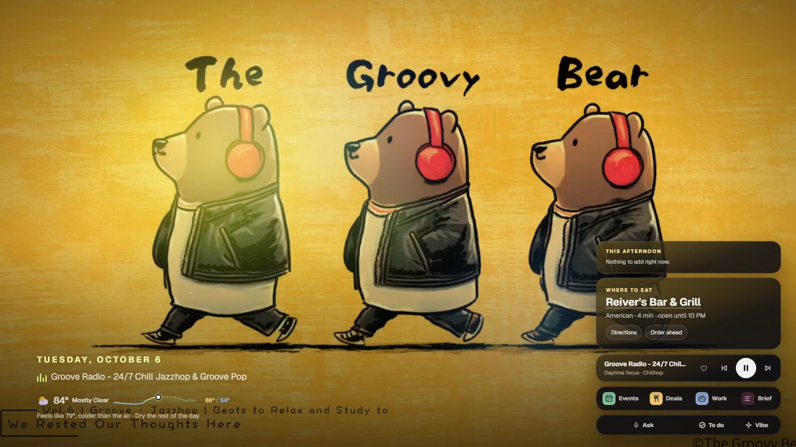

**Wheel down for the feed, a key for a lane.** The wheel slides the feed in. Q and W open Events and Deals as one
pane beside it, and Esc puts everything away.

**Wheel up for the portal.** Scrolling up from the wallpaper (on a phone, pulling down from its top) opens it: the playing artist's art becomes the backdrop,
whole and in its own colors, with one effect after another growing out of its edges, which break into fractal teeth
and put out rows of frets and scrolls; the cards turn to glass over it, and the feed comes up
as portals in place of its rows, nine stories to a page, to browse by picture. Nothing in it is a preset: it is worked out
from the art each time.

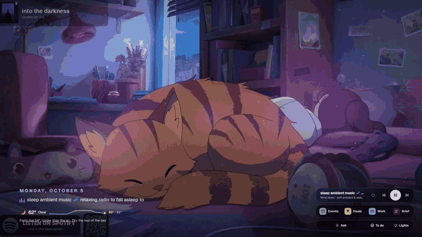

**A story opens in place.** 2 and 3 move a pick through the feed and C opens it. It grows out of the feed's lane, V and B scroll it (with none open they scroll the feed), and Esc shrinks it back. C does too, and marks it read.

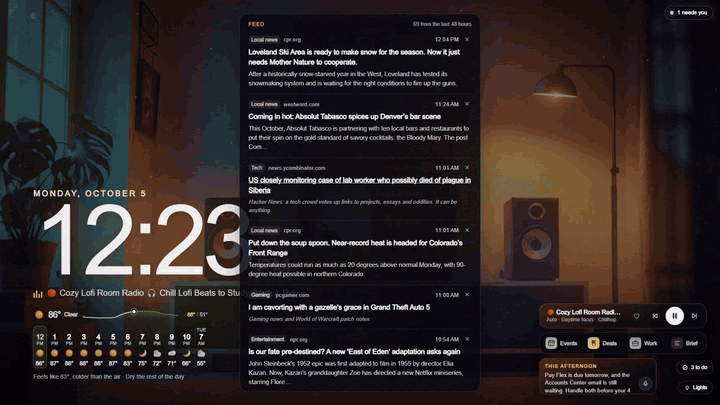

**Events and Deals.** A lane is one pane over the wallpaper, with its own week in the Now card's place: the forecast
beside Events, the week in deals beside Deals. Each lane has two halves, and a hold on its icon or its key switches
to the other one: Events with or without concerts, Deals as Food or Sales. At the top of Deals' Food half is Where
to eat: one place, the two that trade something against it, and Directions, Its site, Order ahead and Another.

| Events (Q) | Events with concerts |
|---|---|
| 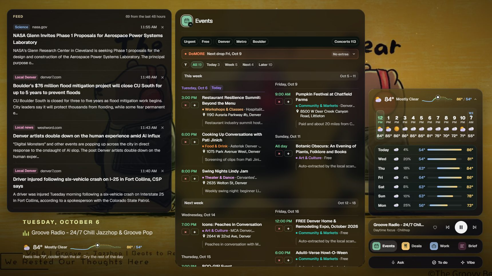 | 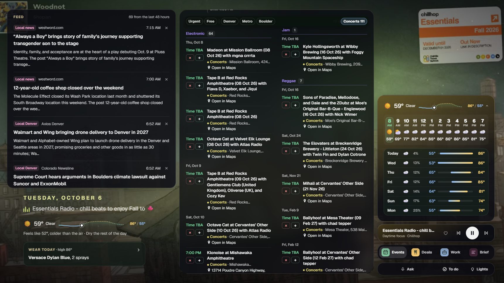 |

| Deals: Food (W) | Deals: Sales |
|---|---|
| 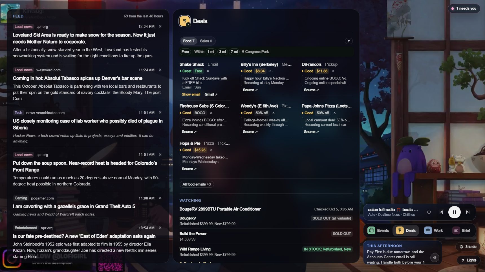 | 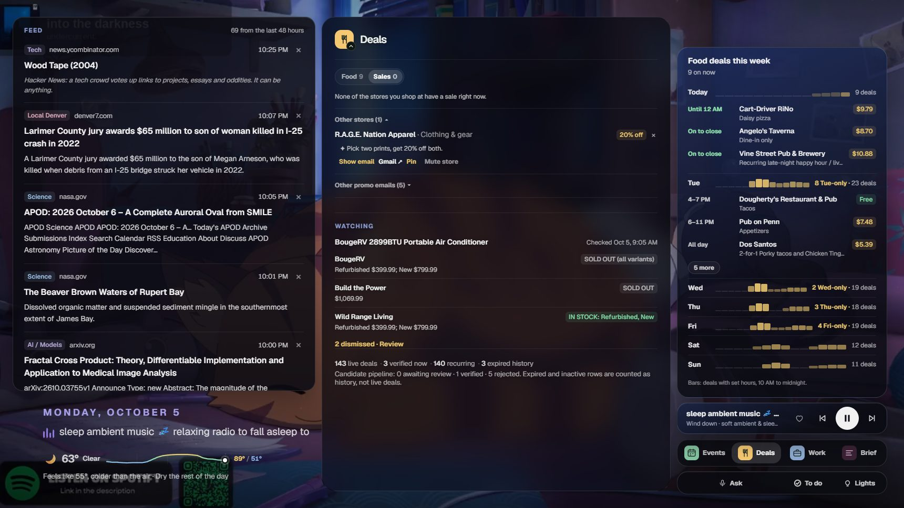 |

**The Work lane** (E), here on made-up driving data. It reads down from the week's figures and a bar for each day to
the map of where offers come from, every offer against the grader's Good and Skip lines, when offers come, and
whether rain changes what driving pays. Beside it, when to drive.

The Good and Skip lines set themselves. Sliders move them by hand, but once there are 30 graded offers over three
days (eight taken, eight passed) they follow your own picks: once a day, before the first offer, they are held
against the last 30 days and moved toward where they would call Good what you take two times in three and Skip what
you pass two times in three. A line moves $2 an hour or 15¢ a mile a day at most and never mid-shift, so the badge
means the same thing all evening. Each move is listed under the sliders with what it fixed ("you took 10 offers the
old lines called Skip") and a button that puts it back; another turns the whole thing off
(`app/graderTune.ts`).

Following your picks makes the badge agree with you more often. It does not show that those picks earn more, so the
lane also measures what the driving paid. A shift is a day's stretches online and the short stops between them,
its money is Uber's own figure for the day less the gas for the miles driven, and an hour's pay is those shifts'
money over their hours: after gas, with the waits and the drives between orders counted. Once there are five shifts
and 15 hours, every offer you took or passed is set against that figure by what it pays for its own time: how many
you took that paid less, how many you passed that would have paid more, and, where you went against the badge, what
doing as it said would have changed. The lines are held to the same figure. Your picks cannot bring Good under an
hour's pay or Skip over it, a line found on the wrong side of it is stepped back, and each move is listed with what
the shifts before it and since have paid (`app/graderOutcome.ts`).

The grade is taken on the traffic ahead of the trip, not the traffic on the card. Uber's minutes are the roads as
they are when the offer is drawn, so they are stretched for how the roads usually get over the trip: a time-of-day
curve corrected by your own timed trips, or with a TomTom key the forecast for the trip's own roads
(`app/trafficCurve.ts`, `app/routeTraffic.ts`). Neither of those
knows that a show ends tonight, and the Events lane does; nor that there is a game on, which the home schedules of
the Broncos, Rockies, Nuggets, Avalanche and Rapids give, read twice a day with no key. An event or a game at one
of 17 large venues around Denver (1,500 seats and up) slows the streets around that venue while its crowd arrives and, more, for the hour after it
ends, so a trip that is on those streets then is forecast longer, before the crowd is on the road,
and the badge says why ("Ball Arena lets out about 11 PM"). Where each venue is and about how many it holds are
facts; how far the slow streets reach and how slow they get are a starting guess, an event with no end time is
taken to run three hours and a game as long as its sport usually does, and a venue that is not in the list adds
nothing. `GET /api/uber-offer` lists the crowds
it sees for the next day (`app/eventTraffic.ts`, `app/gameSchedule.ts`).

The grade is the trip, wherever it ends: the next order comes wherever you are, so no drive to a busier area is
counted. The exception is the drive home at the end of a shift, which nobody pays for. With `HOME_POINT` set, an
offer that would leave you farther from home than you are is read against your own recent shifts at this time of
day: of the shifts that were on the road between now and the hour after this trip would end, how many were over by
then. That share of the extra drive home (home from the drop-off, less home from where you are) is added to the
trip's time and gas, so the dollars an hour are for all the time the offer takes from you, and the badge says so
with the count ("18 min farther from home, 14 counted: 8 of 10 shifts done by 10:10 PM"). At the start of a shift
the share is small and nothing is counted. An offer that ends no farther from home is not marked down, however
late it is, and one that takes you toward home gets no credit; both are only said. Fewer than eight shifts to read
the hour from, a drop-off that could not be placed or no home set: nothing is counted. How late counts as late is
not a setting: it is whatever your last two months of shifts say, and it moves when you do
(`app/homeLeg.ts`).

Uber's weekend quest, so many trips by Monday morning for a bonus, chosen from a list by Thursday night, is read and
reasoned about the same way. Pulse Mobile sends Uber's "Select next Quest" screen as it sends any other, the list is
read from it, and the Work lane says which quest to choose: each quest's bonus times the chance of reaching its
goal, from the orders you delivered in your last eight weekends, and never past a goal you reached in fewer than two
of your last four. When two quests come out within a couple of dollars it says so, what each pays, and what would
tip it; it does not dress a guess up as a figure. One tap says which you chose. While a quest runs the lane says how
much driving is left at your own pace and the bonus it is for, and the offer book counts its trips, each customer
of a batch one as Uber's terms have it (two orders to one door still count as one, so it can run an order short of
Uber's own count), and its declines. On a card, a quest is worth the change
the card makes to the chance of the goal. That is cents for most cards, since the next order comes with or without
this one, so it is counted into the grade only from a dollar up, and near a goal the badge says what is left in
words (`app/questPick.ts`, `app/questChance.ts`,
`app/quests.ts`, `app/questMenu.ts`).

The lane's calls are also said where they are needed: over Uber Driver, on the same badge that grades an offer.
Pulse Mobile sends the screen Uber Driver is showing, the PC works out which moment that is (offline, waiting for a
request, on the way to a restaurant or a customer, Uber's list of quests) and answers with the calls that apply
there, and the phone draws them one at a time. A tip interrupts, so it is held to more than the lane is: only a
call the log is sure of, your acceptance floor only on Uber's own figure and never on a worst case, stopping
requests only on a gap chance explains less than one time in a hundred, when to drive only with your calendar in
hand (the PC keeps what the dashboard was last given, and says nothing on a copy that is partial or older than ten
minutes), an hour to avoid only on a count that sure, and each said once: the phone tells back what it has shown,
the PC keeps that, and passes over it until it may be said again. A tip never covers an offer or its grade, comes
down when the screen changes or Uber Driver leaves it, and is decided on the PC, so one that turns out wrong is
fixed without a new build (`app/overlayTip.ts`, `app/calendarKept.ts`,
`TipGate.java`).

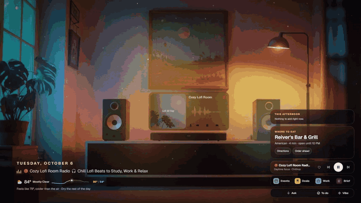

| The week and the days | Where it happens |
|---|---|
| 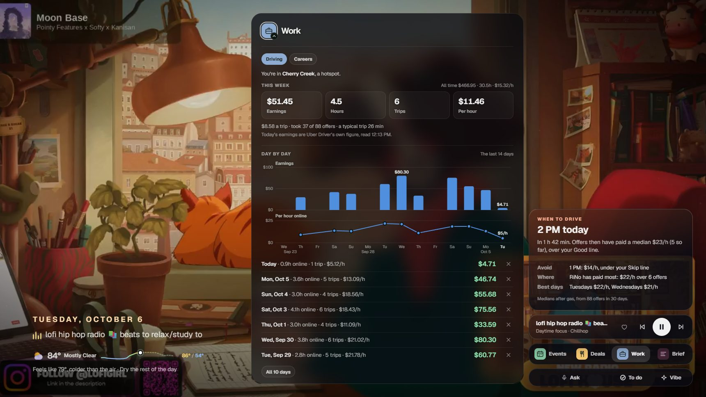 | 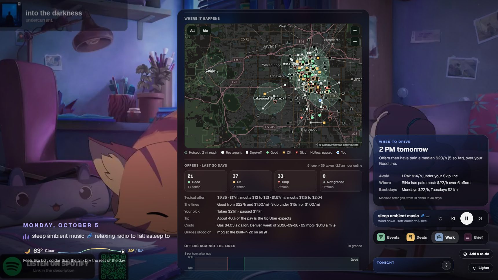 |

| Offers against the lines | Rain against dry |
|---|---|
| 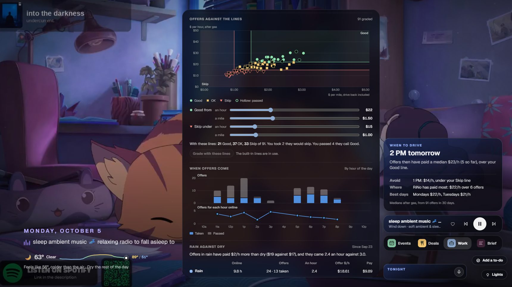 | 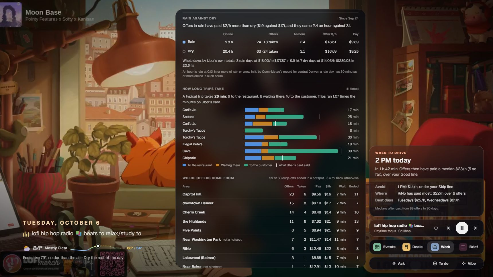 |

**Music** (1). The Music view opens over the player: stations through the day and by genre, and the concerts coming
up, by genre, each one playable. 2 and 3 move a pick through the rows.

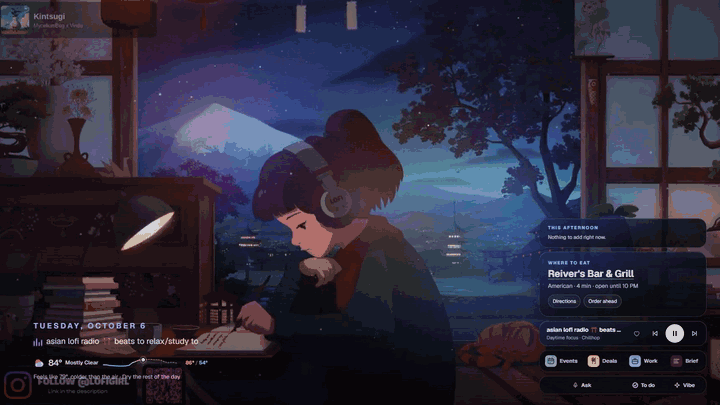

| Stations | Concerts |
|---|---|
| 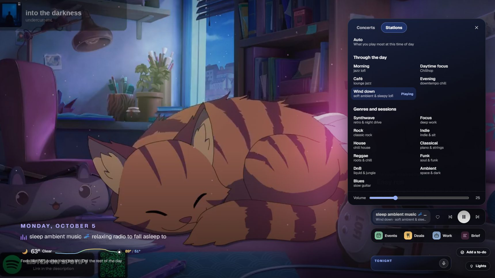 | 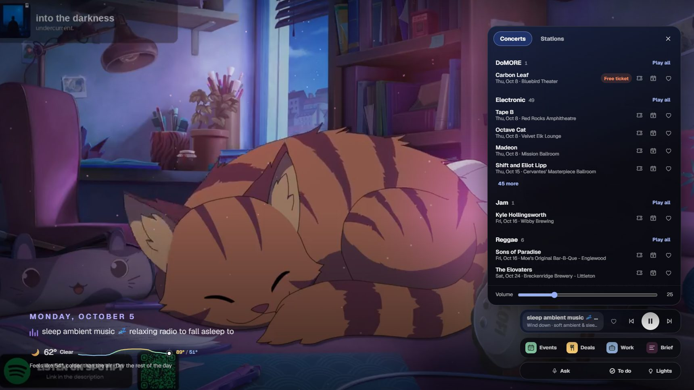 |

**Beside the lanes.** R opens the briefing over the Now card. At the foot of the column is one tool bar: Ask is the
microphone, and resting the mouse on it (or B) brings up Hungry, What now? and Another; Vibe opens the desktop
background's row over the Hue controls, and To Do (4) opens the list with its add box.

| The briefing (R) | Ask's actions |
|---|---|
| 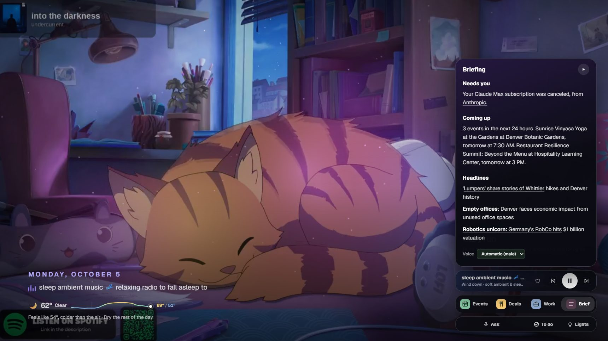 | 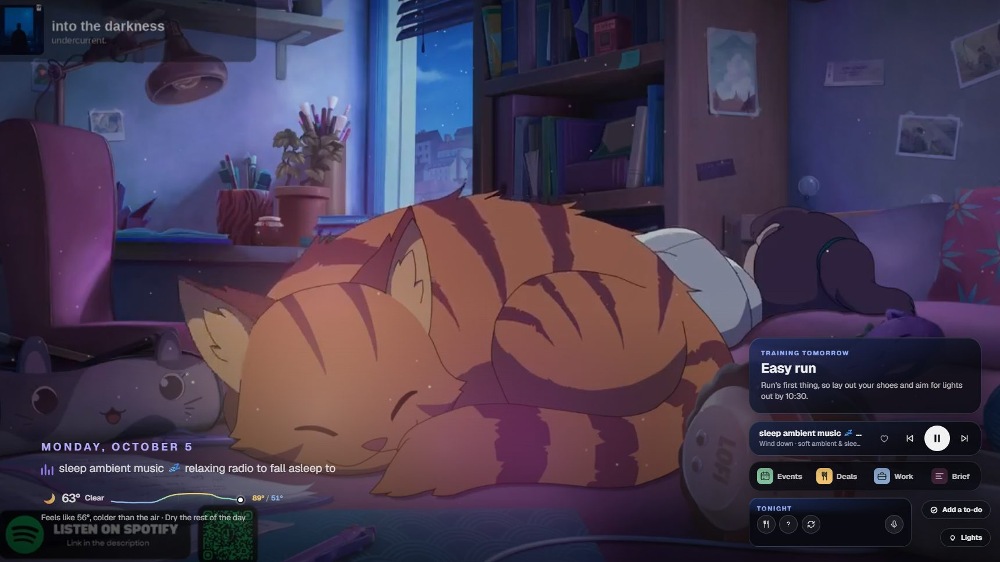 |

| Vibe | To Do (4) |
|---|---|
| 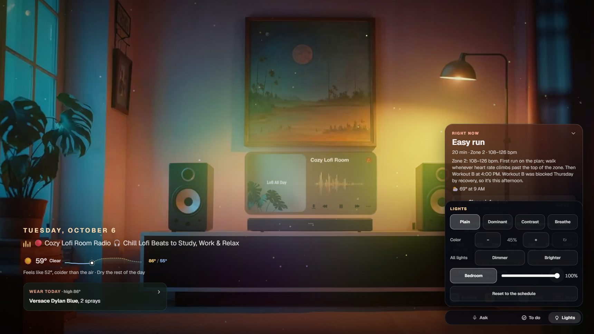 | 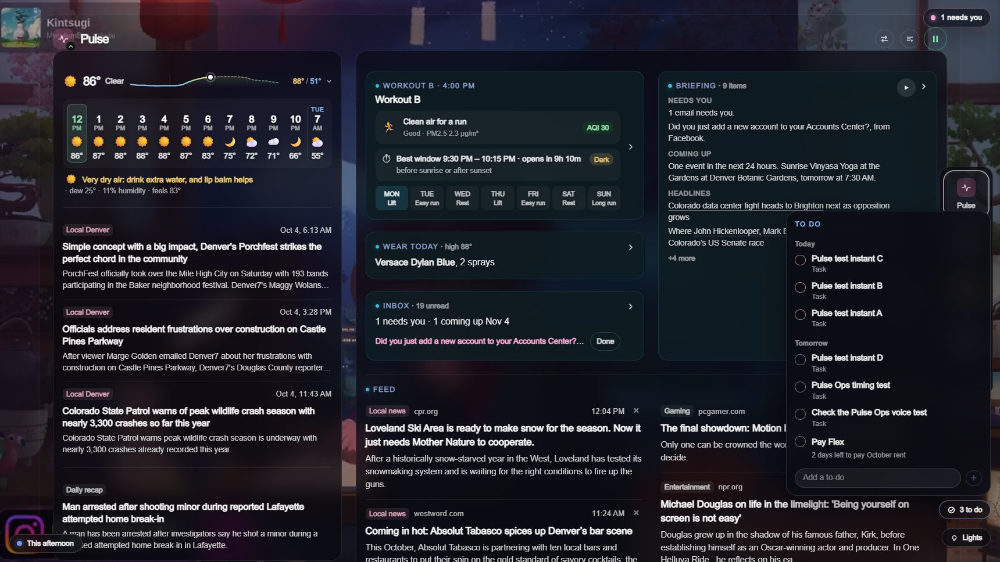 |

The key list (?):

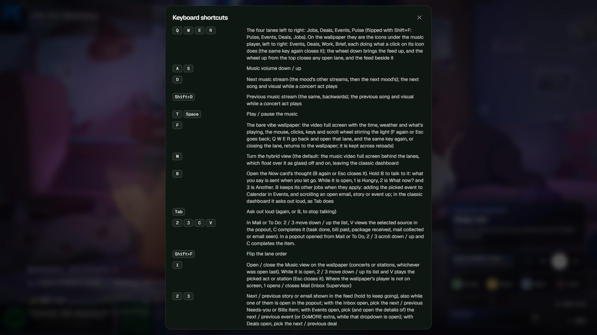

**On a phone.** It starts on the wallpaper, as bare as the PC's: the date and one line of weather with the day's
temperature graph at the bottom left, and the lane buttons in a column at the right edge, under a thumb, with Drive
Home's house on top of them. The Now card is a short scroll below. A lane opens as glass over the wallpaper; the Work lane here is on made-up driving data.

<p>
  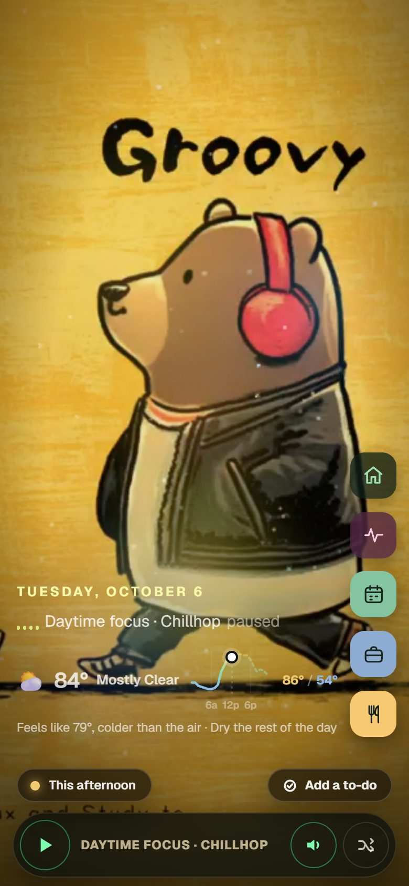
  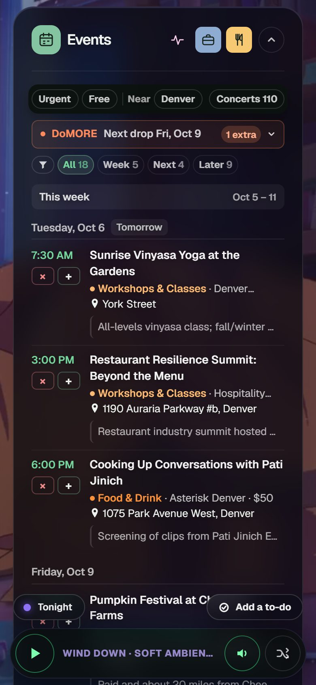
  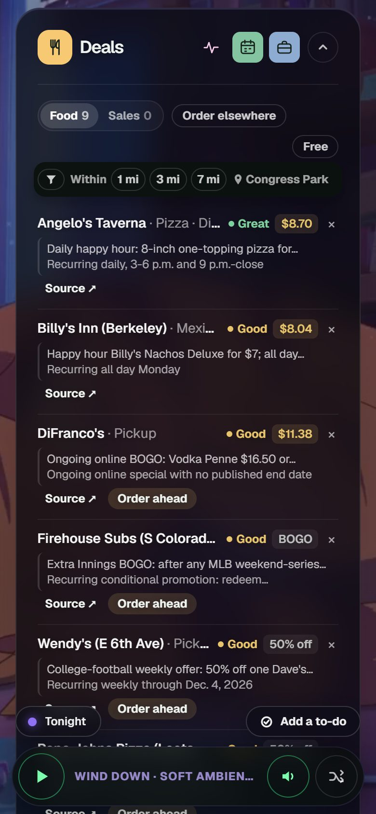
  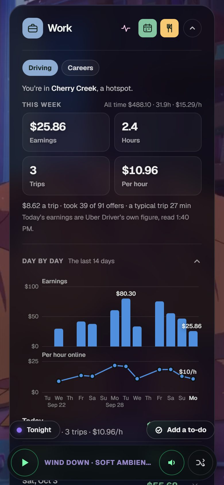
</p>

## The four lanes

The lanes are **Pulse, Events, Deals and Work**. On a PC each opens as one pane of glass over the
wallpaper, from its icon under the music player or its key, and closing it lands back on the wallpaper; there is no
other view to switch to. On the primary monitor the lanes read Pulse, Events,
Deals, Work, and Q/W/E/R follow that order. **Shift+F** mirrors the lanes, and their keys with them, for a monitor on
the other side of the desk; the choice is kept per screen.

On the wallpaper (1200 px or wider) the lanes are a row of icons under the music player: Events, Deals, Work and
**Brief**, which opens the daily briefing over the Now card. An icon or its key opens the lane as one pane over the
wallpaper. The same icon or key closes it, another one swaps it, and Esc or the mouse's Back button closes it. Wheel
down anywhere on the wallpaper, or T, slides the feed into the middle of the screen; wheel up from its top, T again
or Esc slides it back out. From 1700 px the date stays beside the feed, and an open lane sits between the feed (docked at the left
edge) and the Now column. Narrower than that, the lane takes the feed's place. Wheel up from the top closes an open
lane and the feed beside it.

Wheel up on the bare wallpaper, or Shift+T, opens the **portal**. The playing artist's art (a concert act's cover,
or the stream's own) becomes the backdrop on one canvas. The art is the subject, so it is shown whole and sharp:
fitted to the screen instead of cropped to fill it, with its own colors carrying on past its edges. It is shown in
four psychedelic looks, one after another, each built from the visual effects reported for the experience it is
named after (what the people who make psychedelic replications catalogue), and each a range of them that rise and
pass while it is up, never one fixed look. What they share is where it happens: on the picture's own edges. When a
picture loads, its edges are traced into lines, the way an edge detector does it, and each line is measured: how
far any place is from it, how far along it, and how much room it has on each side. A look then breaks those lines
into teeth that carry smaller teeth that carry smaller ones still, a fractal, and stands rows of ornament on them,
each row twice the size of the one inside it, into the room the line has and no further. One number takes every
shape from round to square, a vine's scroll to a squared hook and an arch to a stepped pyramid, so nothing is
picked from a set of pictures. One look has an arabesque's scrolls, flat and bright, with the rainbow running
along the edges and moving off them in rings. One has the step fret of Aztec and Maya work: edges that are stairs
of stairs, with squared hooks and stepped pyramids cut into the picture like stone, in its own colors. One strings
stepped diamonds along edges broken into points, each a stone in one of the picture's three strongest colors, and
its highlights glint. One has every ornament at once, turning from round to square and back, two layers deep, its
colors changing places a shape at a time. Away from its edges the picture is left sharp and in its own colors, and
it drifts only in spells, still between them. All of it is done to the
picture itself, which is never folded, tiled or replaced. A new one comes about every minute, in an order drawn
for that picture, and never the same one twice running. Hold the mouse down on the wallpaper and drag, and filigree
grows along the way and branches off it: pen strokes in the art's colors that put out leaves, sway and carry a
glint of light, drawn into the picture itself so that they move with it, and drawn back after a while. Every part
of the dashboard is changed with it: the cards are glass with the art's light behind them and its colors on their
edges, their corners melt to new shapes every few seconds, and the colors of their words part. With the feed up, its stories are
soft-edged portals in place of its rows, nine to a page, each its own picture, in the feed's order: the one the
pointer is moved onto comes forward, a click on it opens it at the feed's left with its story where the feed is, the
wheel down over it or anywhere on the wallpaper off the story, or a click on the background, puts it back among the
others, and with none open the wheel down turns to the next page, up turns back, and up from the first page puts them
away. None of it is
picked from a list of themes. The art's own pixels are
measured (its light, color, contrast, warmth and strongest hues), a vision model running on the PC then reads the
picture once (a mood, an energy, a way of moving, a surface, and five dials for how a line drawn in its hand
behaves), and every choice left over is seeded by the picture itself and the clock, so two artists seldom look
alike and the same one does not look the same for long. Esc or Shift+T closes it and the wallpaper is as it was; it stays open across reloads if left
open. On a phone a pull down from the top of the wallpaper opens it and the same pull closes it: the cover sits in
the upper half of the screen and fades into its own reflection behind the words, there is no filigree, and the Vibe
controls in the Pulse header have the same sliders (`app/wallVibes.ts`, `app/portalEngine.ts`,
`app/artEdges.ts`, `app/artVibe.ts`, `app/filigree.ts`, `app/filigreePaint.ts`).

Pulse has no pane on the wallpaper, because its pieces already live there: the weather and the scent pick under the
date, mail in the Mail pill, the stories in the feed, the briefing behind Brief, and the workout in the Now card. Its
key brings the feed up and puts it away. Under 1200 px there is no feed over the wallpaper, so Pulse keeps its icon
and pane. A story opened from the feed is not a pop-up: it grows out of the feed's lane to fill the room up to the
Now column, and Back (the button, Esc, or the mouse's Back button) shrinks it into the lane again.

A phone starts on the full-screen Vibe wallpaper, which shows off the video like the PC's: the date is bare text at
the bottom left, and the weather is one line (an icon, the temperature, the day's temperature graph, the high and
low). The Now card with its thought starts just below the fold, so a short scroll shows it. The four lane buttons
float in a column at the right edge, under a thumb, while the page is at its top, with **Drive Home** (a house) on
top of them away from home; the music bar sits along the bottom with the Mail and To Do pills above it.
Closing a lane or using Back returns to the wallpaper; a swipe down closes it too. A lane always opens at its header.
A swipe up scrolls to the Now card, and the same swipe carried on past it slides the feed up as a sheet; one swipe
down puts it away. The Now card's play button is available on phone and PC. It reads the card's current
content aloud using the saved feed voice; press again to stop.

In the Vibe views,
the **Now** card brings forward the one thing that is happening now or about to: an event within 90 minutes, the
workout around its planned start (a lift from two hours before to three after; a run from an hour before to 90 minutes
after, the end of the usual time to run), or on the phone the morning rundown. Nothing that is not now gets a card:
tomorrow's session is not shown the night before, and a session whose time has gone by is not raised again that day.
Every card has one shape: a line that says when ("4:00 PM · in 40 min", "Right now"), the thing itself as the lead,
then quiet lines with what is needed for it. **I’m hungry** puts where to eat on the card: the one place
[Eat](#eat-where-should-i-eat) picks for where you are and the time, with what it serves, the drive and how late it
is open, **Directions** and **Order ahead**. It is the pick the Deals lane's card shows, never whichever deal happens
to be on. With no location there is no pick; an old location, or home, is used and said.
**What should I do right now?** requests a fresh, quick contextual answer. **Another** skips the current recommendation
for 90 minutes (a place to eat is turned down along with the places shown beside it, and a different one is offered), starts the conversation over and asks for a more
considered answer with a compact explanation (it replaced the separate Think deeper and New thought buttons). **I ate / I’m done** clears the current request. Hunger also expires after 90 minutes.
Choices are saved on the local server and shared by PC and phone. Patterns across at least three different days at
similar times and in the same area can favor food or deeper answers; repeated restaurant dismissals lower that
restaurant's rank. An imminent calendar commitment keeps priority. This is separate from the disabled music/Hue
habit learners. The drive to a place to eat is TomTom's for the places shown; without it, it is worked out from the
distance and said as "about N min".
During the scheduled run window, Now shows the run as its name, one line of targets (duration, heart-rate zone), the
plan's note and the weather at its start; on the PC's wallpaper the air, the best window to run and the week follow.
The detail waits behind a click anywhere on the card (the chevron in its corner): the last recorded run's time,
distance, pace and average heart rate, the recent distance, pace and run-only heart-rate graphs, skeletal muscle and,
on the PC, the body trends. A click on the bare wallpaper closes it again; with no run recorded there is nothing to
open. Body-composition and mixed workout heart-rate charts remain in the training panel.
Load sparklines sit beside lift targets when the health brief carries enough history. The Now card uses an aligned
header, content and action grid, with hidden scrollbars while keeping wheel and touch scrolling available.
The bare wallpaper also shows how the weather feels and rain timing, with no row of hours. On the PC's wallpaper the
thought is a card of its own on top of the Now card, there only while it has something to say: it rests two lines tall
and opens upward on hover, with B or while you talk to it. The Now card there shows only the moment, and with no moment
there is no card. Talking to it is the **Ask** button at the foot of the column, in one bar with To do and Vibe: a
click listens (and the next click sends what you said), and resting the mouse on it, or B, brings up Hungry / What
now? / Another. The PC's wallpaper has no morning rundown either, since everything in it is already on screen.
While a lane is open over the PC's wallpaper, the Now card's place holds that lane's own week. Beside **Events** it is
the week's weather, with the rainy days opened hour by hour. Beside **Deals** it is the week in food deals: today as a
timeline (what is on by when it ends, what starts later by when it starts), then each day with a bar of when its deals
with set hours run and the specials that run on that day only, with their hours. Today's and tomorrow's are open; a
later day opens on a click. It follows the lane's own filters. Beside **Work** it is when to drive: one lead, the next
stretch of the hours your own offers have paid best (the median after gas, once more than one offer was seen in the
hour) that your calendar leaves free, then only what would change the plan: the hours that have paid under your Skip
line, the hotspot that has paid most, a day your calendar takes, the weekdays that have paid most. Nothing in
either is a guess at demand: the sheet's schedules, your calendar and your own log
(`app/dealWeek.ts`, `app/driveWeek.ts`).
The thought is never the Now card over again: it says the one useful thing the screen is not showing (a bill due
tomorrow, an overdue to-do, mail that needs you, something on the calendar through tomorrow), or nothing when nothing
qualifies. It is written as a short lead with at most one quiet line under it, headed by where the thing lives
(Calendar, To do, Bills, Packages, Mail, Training, Food), by the time of day when there is no thought, or by the
conversation once you speak (`app/nowThought.ts`). The **microphone** (the Ask button on the PC's wallpaper, the right end of the card's actions elsewhere) makes the thought a back-and-forth: say
something (Chrome or Edge) and Pulse answers it from the same snapshot, with the thought and the earlier turns as
context. What was said and each answer are listed under the thought. Nothing is saved: the conversation lives in the
open page and **Another** starts it over. On a PC, **B** opens the thought (B again or Esc closes it) and holding **B**
is the microphone: what you say is sent when you let go. While B has it open, **1** is Hungry, **2** is What now? and
**3** is Another. The microphone needs a secure address (`localhost` on the PC, or https): on a plain-http LAN or
Tailscale address the browser refuses it, and the card says so.
A browser that opens the plain-http Tailscale address (`http://100.x.y.z:3000`) is sent to the https one that
`tailscale serve` publishes, set as `PULSE_HTTPS_ORIGIN` in `.env.local` (`app/secureAddress.ts`, `/api/secure-address`).
Pulse Mobile keeps the plain address: it loads it on purpose and has its own speech bridge.
Automatic checks share a thought for about 30 minutes; a new intent request gets its own answer, while retaining
the daily call limit and sharing the same request across devices. Deeper requests use the signed-in ChatGPT
CLI with **GPT-6.1 Sol**: the first two use **medium** reasoning and later requests **high**. Each request
re-reads the connected calendar, tasks and dashboard. Later requests add inbox summaries, more news and training history,
local events, job options, and the full text of up to four news articles. Food comes from the located, active shortlist,
respecting hunger and dismissed restaurants. The time window expands from 3 to 7,
14, 21 and 28 days, then caps at 30 days; the evidence allowance grows from 8,000 to 32,000 characters.
The source-details row shows which sources contributed and which were unavailable. Earlier thoughts travel with the
next request to avoid repetition. Progress is shared across devices, saved outside the repository in
`%LOCALAPPDATA%/PulseOps/now-thought-research.json`, and starts again each Denver day. Only successful manual thoughts
advance it. `NOW_THOUGHT_RESEARCH_FILE` overrides the state location for isolated previews.
Quick thoughts use the Anthropic API key when one is set, then the signed-in Claude CLI (Sonnet with thinking off,
about 5 seconds), then the signed-in ChatGPT CLI; `NOW_THOUGHT_PROVIDER` forces one of them
(`app/nowThoughtCli.ts`). Learned deeper answers use the established research
level. A new explicit deeper request advances it. A failed request shows a message; a changed intent or location clears
the previous answer so it cannot be mistaken for the new recommendation.

**1** opens Mail and **4** opens To Do. Mail appears above the Now card. **B** also opens the Vibe to-do list when it is not adding a selected event to Calendar or scrolling an open reader.
The list brings together tasks, bills, packages and upcoming calendar entries. While pinned open, 2/3 selects a row,
C completes the selected task, marks a bill Paid or a package received, and V opens its source in the reader panel.
In either list, 2/3 moves down/up, V views the selected source in the popout, and C completes it. Inside the source popout, 2/3 scrolls the content and C completes its item. Hovering the Inbox Supervisor or to-do pill opens it, moving onto its contents keeps it open, and clicking pins it.
The Mail pill is not drawn while nothing is waiting. The To Do list has an add box, and a to-do can also be spoken
("remind me to call mom tomorrow", "add milk to my to-do list") into the Now microphone or the ask box; it is saved to
Google Tasks without a model call. A new to-do shows at once as a pending row, and a slow Google Tasks read is
answered from the last list kept on the PC, so the list never waits on it. The **Vibe** button on the PC, the Lights pill
until 2026-10-06 (on a phone, the controls in the Pulse header), has the Hue controls for clicking, under two rows
for what is behind everything: the PC's desktop background and a playing band's art (see the Vibe button below).

| Lane | What's in it |
|---|---|
| **Pulse** | The 6:30 AM update and evening recap from Pulse Agent's `pulse_local.py`. Live weather and air quality for the phone's location, with a week forecast that opens automatically on days with rain, storms or snow. The training card (today's session, the week, lift targets, body composition). The collapsed home view shows a written summary of RSS and newsletter stories, plus unread newsletter highlights; opening it reveals the source links. The feed below is one list of stories, newsletter mail and Instagram posts, newest first, with no filters; each can be read in place, dismissed or (for mail) unsubscribed from. The briefing card reads the day aloud. The scent card (below). The music player. |
| **Events** | Upcoming Denver events from the Event Ledger, with 3/8/15 mi distance chips, a Free filter and categories. Can be overlaid with your own ICS calendars, Google Tasks (with a Done button), tracked-artist concerts from Songkick (a concert's ticket button opens the TicketData price comparison), and DoMORE tickets (claimed tickets, bonus and last-minute extras, the next drop, and clashes with your plans calendar). Events that the week's forecast says will get rained on are marked. Rows can be dismissed and restored. |
| **Work** | Two tabs. **Driving** is the Uber log, with nothing typed in: earnings, hours, trips and pay per hour for the week, from Uber Driver's own earnings figure, the deliveries it sends you on and its time online, all reported by [Pulse Mobile](#pulse-mobile-android-app). A status line shows whether Uber Driver is offline, online, on an offer or on a delivery. Under it is what to do now, each call from your own log: whether to stop new requests while you deliver (by your acceptance rate, and by how stacked offers have graded against the ones that came while you were free, the same time of day and trip length set against each other), where to go online next (where you are, unless a place your own trips have paid more from is worth the drive) and when (from how long the first offer has taken to come). A call the log cannot make yet says how much it has. The hotspots on the map are made from where the restaurants that sent you offers are, not picked by hand. Opened in full it adds the graphs and the map, and every offer against the grader's Good and Skip lines, which follow your own picks by themselves, a little a day. A switch on the lane sets the span the graphs are drawn over: the last 30 days, 90 days, a year, or everything on record. **Careers** is the science and geospatial roles from the job pipeline, grouped into a few areas, each with an application stage (Saved, Applied, Interviewing, …). Stages are shared between devices. A warning appears if the pipeline hasn't run in the last day. |
| **Deals** | At the top of the Food half, **Where to eat**: one recommended place and up to two alternatives, picked from every restaurant around you and not only the ones with a deal (see [Eat](#eat-where-should-i-eat)). Under it, verified and recurring food deals, shown only while they're running (weekday, date range and happy-hour windows from the sheet) and while the restaurant is open: a place that is shut, or closing within 30 minutes, is left out, and one closing within the hour is marked. Rockies game-day deals show the day after a qualifying game, checked against MLB's Stats API. Every deal that isn't dine-in only has **Order ahead**, the place Eat picks always has it, and **Order elsewhere** beside the Food / Sales switch takes a typed place: Muse decides what to order and builds the cart, you say go or veto it, and nothing is paid until you say go (see [Ordering ahead, through Muse](#claude-connector-mcp)). Also here: food emails that were moved out of the feeds card, the gear watch, and dismiss/restore. |

Some Pulse pieces need a little more explanation:

- **Feed.** One list of RSS stories, newsletter mail and Instagram posts, newest first. Mixed feeds sort by actual
  publication time, including timestamps from different time zones; mail is interleaved with stories rather than
  collected at the top. There are no source or topic filters, but the list has three orders: Newest, Topic and
  Source. The last two put the same rows in groups, the group with the latest story first, and show the first
  three of each until Show all, so every topic and every source is in sight at once. A story opens as the dashboard's own text and
  pictures (`app/articleBlocks.ts`); the original page is the fallback and one tap away.
- **Sales.** Clear sale subjects such as "Last chance to save on summer shorts" go to Sales even when Gmail has
  not labelled them Promotions. Sales and mail labelled Promotions stay out of the feed and feed summary.
  The phone overview's Deals card has a **Food / Sales** switch and previews the selected list; opening the lane
  keeps that selection, and returning or reloading remembers it.
- **Emails.** Routine mail is marked read in Gmail before it ever reaches the page. That covers stale sign-in codes,
  sign-in notices, policy and terms updates, surveys, win-back mail, and payments that went through. Anything that
  looks like real trouble (a locked account, a changed password, a suspicious sign-in, a failed payment) stays on the
  page and is flagged important. Every auto-dismissed email is logged to `~/.leviops/auto-dismissed-email.jsonl`.
  Fresh codes that can be extracted from the subject or snippet stay for 15 minutes. Tap the code to copy it and
  clear the email; if copying is unavailable, the code is selected for manual copying. The closed Inbox card shows
  up to three pressing emails with Copy, Seen, Paid or Done actions, and tapping a line opens that email. Mail refreshes
  every minute while the page is visible and when you return to it. Payment receipts and billing-change notices
  are kept out of Bills. The rules are in `app/personalEmail.ts`.
- **Physical mail.** USPS Informed Delivery notices appear in the Inbox Supervisor, grouped by their received day,
  with a mail-piece count and **Mark collected** action. Collection clears every notice behind that row; the Inbox
  card's **Collected mail · Review / undo** list can undo it, including notices collected before that control was added.
  2/3 selects physical-mail rows and C marks the selected row collected.
  Uncollected notices retain their original date after midnight. Tracked packages remain in Events.
- **Bills.** Every unpaid bill goes to Events: on its due day, today when overdue, or on the day it arrived when
  no due date can be found (labelled **no due date**). Bills stay out of the Inbox card and its spoken summary.
  Opening a bill reads its source email in the pop-up reader. Marking it Paid in Events or the Vibe to-do list
  makes it available under **Paid bills · Review / undo** in the Inbox card; Undo paid marks the thread unread again.
  The sample test bill is no longer injected into the live dashboard.
  Routine bank/account statements and ATM/cash withdrawal confirmations are excluded from the Inbox Supervisor,
  including its unread counts, quick actions and spoken summary. Bills remain visible in Events; failed
  transactions, fraud warnings and explicit requests retain their relevant alerts and actions. These display
  exclusions do not mark mail read.
- **Scent card.** Picks what to wear, and how many sprays, from the weather, the time of day and tonight's plans. It
  draws on the shelf you keep in the card and on Fragrantica's "when to wear" votes
  (`app/fragranticaCrowd.ts`). A new bottle's name, or a photo of its label, is looked up by the signed-in Claude CLI on this
  PC (no API key), or by this PC's Ollama models when Claude cannot answer and the graphics card has room.
- **Feed summary.** The closed card previews two stories on phones and five on desktop; tap it for the full summary.
  Story links are woven into the summary's own words. **Listen** generates a separate spoken news brief: a few
  connected paragraphs that group related coverage and highlight the most useful stories. It is written by the
  signed-in Claude CLI by default (see `ASK_PROVIDER`), and the script is cached for replay. While preparing,
  the button shows progress and can cancel playback. If the model is unavailable or its output fails validation,
  the voice reads a short paragraph fallback without section headings or topic labels.
  In expanded Pulse, the RSS/email feed sits directly under the workout and feed-summary cards.
- **Outdoors.** Off-season avalanche status, snow and river readings sit inside the weather dropdown. Active avalanche
  forecasts keep their visible Outdoors card.
- **Training and weather.** The workout card includes today's best run window, using weather, air quality, daylight
  and the personal calendar. This is a visual notice only; it does not flash or recolor the lights.
  It hides the row when the window has passed or its inputs cannot be read. The dew-point
  comfort line appears only when Pulse is expanded, including the phone's opened Pulse lane.
- **Music.** The picker groups **Daily moods** (Morning, Daytime focus, Café, Evening, Wind down) separately from
  **Genres & sessions**, and every one of them has its own part of the day. Auto plays synthwave from 2 AM,
  downtempo from 3, reggae from 4, classical from 6, morning jazz from 7, Chillhop from 8, deep focus from 9,
  blues from 10, funk from 11, indie from noon, house from 1 PM, café jazz from 2, classic rock from 3, drum & bass
  from 4, dark ambient through the 5 to 9 PM working stretch, and Wind down from 9 PM until 2 AM. Wind down
  starts on soft sleep ambient, with calm space music and sleepy lofi alternatives. When a new part of the day
  starts, the station listened to most in it comes on; with none yet, the first stream of its genre does. Pick any
  genre by chip or say, for example, "play drum and bass", "play ambient", or
  "play blues". DnB and Blues each have two live streams; Ambient has seven, dark and sci-fi. Click the selected chip again to cycle its streams.
  A YouTube embed: a slim control in the Pulse header on a PC, and a fixed strip at the top of the page on
  a phone. With no saved level it starts at 25% volume and picks a stream for the time of day. PC tabs share their
  volume; the phone keeps its own saved volume, mute setting, and play/pause choice. Reopening or refreshing a phone
  last left playing attempts to resume; a phone left paused stays paused. If the browser requires a gesture to
  resume audio, the next tap retries it. A first visit waits for Play, and temporary pauses for other audio do not
  overwrite the saved choice. The dashboard takes on the
  colours of the video that's playing. The keyboard's Play/Pause key works as soon as the page is open. Voice commands can drive it
  too (see `app/musicRemote.ts`). On a phone the
  music keeps playing with the screen locked: this PC fetches the stream's audio with yt-dlp and ffmpeg and sends the
  phone a plain MP3 stream (`app/audioRelay.ts`, `/api/music/audio`), with Play/Pause/Next and
  the stream's picture on the lock screen. Tap Play to start it on the first visit. yt-dlp and ffmpeg live in a venv at
  `C:\Users\YOU\Documents\Codex\PulseOps-tools\media-relay` (setup in `app/audioRelay.ts`), and yt-dlp updates
  itself daily. The relay retries brief upstream network failures and times out silent reads after 15 seconds.
  The PC also replaces ended, failed or silent audio sources inside the same MP3 response, refreshing the upstream
  URL with up to five consecutive retries. This recovery does not depend on background phone timers. The moving
  backdrop pauses while the page is hidden, and resumes on return.
  The phone checks playback progress every five seconds; after 30 seconds without progress it reopens the stream
  with a fresh upstream URL, including while hidden when the browser permits timers. Returning to the page or
  reconnecting the network also checks for a stuck stream. Recovery is bounded to five retries; Play starts a new
  attempt, and intentional or temporary pauses cancel pending recovery. If the relay can't start, the phone falls back to YouTube's player, which pauses while the screen is
  locked and starts again when you're back (`app/backgroundPlay.ts`). Behind the page the phone
  plays a 10-second, 720p, 15 fps loop cut from the stream (made once per stream on this PC and kept in the venv's `loops`
  folder), instead of the full video that used to crash it. In Vibe the muted wallpaper loop can play before audio
  starts; Play/Pause still controls the music independently, and the loop pauses while the page is hidden.
  In Pulse Mobile the phone's music plays only over Bluetooth: off Bluetooth, Play holds, with no message, instead of
  starting; Bluetooth dropping mid-song pauses the music, and its return within 30 minutes picks it up again. In a
  browser the output is unknown and music plays as before.
  A concert act's songs, and the acts of a genre or of your likes, start on the ones not played lately. What has
  played is kept on the PC (`%LOCALAPPDATA%\PulseOps\music-heard.json`) and not in the server's memory, so a deploy,
  which restarts the server, no longer starts every act over on the same songs.
- **Hue lights.** H switches music colours on at the remembered strength, steps through the video's colour sets on
  each further press, then switches them off; Shift+Z / Shift+X adjust that strength in 5% steps without resetting
  brightness. Z / X dim or brighten the lit rooms 5 points a press (hold to keep going).
  A third mode, Breathe, slides the lights very slowly along a gradient of the video's colors and back (the stretch of the
  color wheel that holds the video's hues; the bulbs sit half of it apart and move at most 30° of hue every three minutes),
  for as long as it is on; in Dominant and Contrast the colors are painted once per stream and J takes another pick. Breathe has no pick
  (J does nothing there, and the light controls drop their ↻ button): it goes through all of the colors by itself.
  The modes stay available while a frame loads. Contrast pairs the dominant hue with a distinct hue from
  the frame, or its complementary color when the scene has only one color or closely related hues. Music colours switch
  in about 1 s, including stream changes, scheduled music-colour updates and restoring colours when switched off. The plain
  time-of-day dimming schedule keeps its gradual two-minute fade. A playing tab supplies the colours (PC preferred among
  players); a paused tab cannot override it. A fresh frame at the stream's live edge is sampled on each stream switch and every
  minute, and successful identical colours are not re-sent. The five-minute dimming task captures that playing
  stream's current frame itself before adjusting music colours, sharing samples for at most 30 seconds; if none is
  available, it leaves the lights as they are instead of repainting
  the saved palette from an earlier stream. Fixed-colour CLI flashes still hold their requested colours.
  The dimming schedule, a stream change and turning music colours off all leave
  manually changed brightness or bulb colours alone until the room is switched off or G resets it to the time-of-day
  default. Turning music colours off otherwise restores the saved bulb colours while keeping the current brightness.
  Reloading the dashboard refreshes enabled music colours from a current frame, even if audio starts paused.
  Returning to the window refreshes its frame and player check-in. The local server also refreshes enabled colours
  on player check-ins about once a minute, so updates keep working with the page in the background.
  The playing tab still takes priority over a paused tab, and manual room overrides remain respected.
  While a concert act plays, the page's tint, the wallpaper's light and the Hue lights follow the act's video or
  album art instead of the paused station, and go back to the station afterwards.
- **Vibe button.** On the PC it is the pill at the end of the wallpaper's tool bar, the Lights pill until 2026-10-06
  (Y opens and closes it, as a click does);
  on a phone the same rows sit above the lights in the Pulse header's controls. Above the light controls it has
  rows for what is behind everything. On the PC the first is **Portal**: closed or open, and while it is open what
  the art was read as, which effect is on it now with a Next beside it, a slider for each thing it does (flow,
  strength, pattern, change, color drift, color split, filigree, melt, fringe: from off to one and a half times what the art
  asks for) and a switch for the glass cards and the feed's portals. **Desktop** sets the PC's own desktop background: **Blackbody** (a shuffled
  slideshow of the pictures in `Pictures\Blackbody\desktop`, 30 minutes a slide), **Bing** (Bing Wallpaper's daily
  picture) or **Auto**, the default, which is Bing from sunrise to sunset and Blackbody through the night. With Auto
  on, the one the sun has up is outlined; picking Blackbody or Bing by hand ends Auto until Auto is pressed again. The
  scheduled task **Pulse Ops Desktop Wallpaper**, registered once from `scripts/` like the other tasks
  ([`CLAUDE.md`](CLAUDE.md) names each script), asks the server every 5 minutes. The server switches once at each sunrise and sunset and runs nothing in between, so a picture set
  by hand in Windows stays until the next crossing. **Art** is there only while a concert act plays: ‹ and › step
  through the act's other videos and album covers without changing the song. A new song keeps the move; a new act
  forgets it.
- **Phone directions.** Tap a deal in the phone overview, or its restaurant name in the Deals lane, to open Google
  Maps. A deal tied to a street address requests driving navigation; a chain-wide deal opens a search so you can pick
  the right branch. Home is `HOME_POINT` in the PC's `.env.local` (never in tracked code).
  **Drive Home**, the house on top of the phone's lane buttons, appears when the phone reports that it is more than a
  quarter mile away, or when its current location is unavailable. A tap is directions home; a hold opens Google Maps
  itself with nowhere set, for any other drive. Google Maps controls whether it starts navigation immediately and whether a floating navigation
  view appears after you leave Maps.
- **Phone alerts.** Open the Pulse header's controls → **Phone alerts** → **Set up alerts**. This saves a random
  ntfy topic on the PC without editing `.env.local` or restarting the server. Install the ntfy Android app with
  **Install ntfy**, tap **Connect this phone**, allow notifications, then return and use **Test notification**.
  Manual subscription shows the same server and topic if the app link cannot open. A successful test means ntfy
  accepted the message; check the phone for receipt. The existing security-email alerts use this topic, the same
  40-per-day cap and 24-hour email-id deduplication. These alerts are triggered when the dashboard reads security
  mail; this does not add a background inbox-monitoring worker.
  Setup lives in `%LOCALAPPDATA%\PulseOps\phone-alerts.json` (or `~/.leviops/phone-alerts.json` without LOCALAPPDATA),
  outside the repository and deployment checkout. Existing `NTFY_TOPIC` / `NTFY_SERVER` environment settings keep
  precedence; `PHONE_ALERTS_FILE` optionally overrides the runtime file. Setup reuses an existing topic and never
  rotates it. Keep the topic private: anyone who knows it can read or publish alerts. The local-only setup API
  returns subscription details with `no-store`; public copies cannot access it.

After a deploy, an open tab reloads itself onto the new build (`app/BuildWatcher.tsx`). It waits
while you're typing or music is playing.

### Eat: where should I eat?

The Deals lane answers what is discounted. Eat answers where to eat: one place, for where you are, the time, what is
open, what is a real meal, what you tend to pick and how far you will drive. A deal is one small part of the score
and never makes up the list. The whole design is in `docs/eat.md`.

One recommendation path (`app/eatServer.ts`) answers every asker, so they always agree:

- **The Where to eat card**, at the top of the Deals lane's Food half: one pick with a quiet line (the food, the
  drive, open until) and its deal only when the deal counts. Under it, **Directions**, **Its site**, **Order ahead**
  and **Another** (with Undo for 20 seconds), up to two alternatives, and **Why**, which lists every part of the
  score and where each figure came from. **Quick**, **Cheap**, **New** and **Later** change the question.
- **I’m hungry on the Now card**: the same pick, with Directions and Order ahead.
- **Ask and the Now microphone**: "where should I eat?", "something quick", "somewhere new", "where should I eat
  later", "what should I get near this event" and "not that, give me another" are answered from it with no model
  call. No model is ever asked for a fact about a place.

How it decides:

- **Places** are every restaurant TomTom Search and OpenStreetMap report within 6 miles, read when you ask from
  somewhere not read in the last 20 hours, plus the deals sheet's own restaurants, looked up by name and address.
- **Gates run before any score.** A place is out when it is closed at the minute you would arrive, closes within 30
  minutes of that, has no hours that can be believed, is not a meal (an ice cream shop, a bar with no kitchen), is
  over 15 minutes away (8 for "quick"), or was turned down in the last 90 minutes.
- **The score** is nine named parts, each held to its own limits and written to the log with the pick: your own
  choices, meal fit, how sure it is the place is there, the drive, novelty, value, closeness to an event, and, taken
  off, uncertainty and repetition. A deal counts only when it is a meal, is not rated "meh", names that address and
  is on when you arrive. It adds 1 at most, so it can break a tie and never rescue a closed or poor place.
- **Alternatives** each trade something the data can show: Closer, Better value, A favorite, Somewhere new or
  Different food. No trade, no alternative.
- **Hours are never guessed.** Each source has its own expiry: the restaurant's own site 35 days, TomTom's dated
  hours 48 hours, an OpenStreetMap tag by when it was read and last edited. Stale hours are a second tier, used only
  when nothing current is left and said to be unchecked. Missing or expired hours are unknown, and an unknown place
  is never called open.
- **Location** is the device's own fix, else the phone's last report. One up to 6 hours old is used and said; after
  that home is used and said; with neither there is no pick.
- **It learns only from what you do**: directions, opening its site, an order, Another, and a visit worked out from
  the phone's own location reports. Nothing learned is stored: it is worked out from the log on every read, fades (a
  liking halves in 45 days, a turn-down in 21) and is capped, so nothing becomes a sure thing or impossible to
  surface. A card that was only shown is not a vote.

The places and the log are kept on the PC (`%LOCALAPPDATA%\PulseOps\eat-places.json` and `eat-events.json`); deleting
either is safe. `GET /api/eat/debug/recommendation?q=something+quick` shows every ranked and rejected place with its
reasons, and `GET /api/eat/events` says how the picks are doing. The outside calls (TomTom Search and Routing,
OpenStreetMap's Overpass and Nominatim) have daily caps in `docs/outside-calls.md`;
`CALL_CAP_TOMTOM_SEARCH=0` and `CALL_CAP_OVERPASS=0` in `.env.local` stop the place reads.

## Where it runs

| Where | Reached by | What works |
|---|---|---|
| **Local server** (`vinext start` on `:3000` on the PC) | `localhost`, the LAN, or Tailscale (MagicDNS names, `*.ts.net`, `100.64.0.0/10`, `fd7a:115c:a1e0::/48`) | Everything |
| **Published copy** (Cloudflare, `pulse-ops-center.levikcarter.chatgpt.site`) | The public web | The page and the live feed. The local-only routes refuse requests, so the page falls back: dismissals and stages are saved in the browser only, weather is a fixed central-Denver Open-Meteo forecast, and there's no mail, calendar or music |
| **Public preview** (Cloudflare Pages, `pulseops-public-preview.pages.dev`) | The public web | A static build filled with invented data. See [`public-preview/README.md`](public-preview/README.md) |

## Where the data comes from

```
 Sheet store in Postgres (queue, food, events, jobs)  Things on this PC
        |                                           (phone location, Gmail via gws, ICS calendars,
        |  scripts/refresh_snapshot.py               Google Tasks, DoMORE, scent shelf, job stages)
        |  (every 15 min, via PulseAgent's local_sheets)                    |
        v                                                     v
 app/queueSnapshot.ts ── the page renders from it      app/api/* local-only routes ── the page calls them
        +
 'Site Snapshot' tab ── scripts/push_live_snapshot.py ──> Cloudflare Worker + KV (edge-feed/)
                        scripts/push_private_digest.py ──>   /snapshot  (public, read-only; the page polls it)
                                                             /private   (read only by the private MCP endpoint)
```

- **`app/queueSnapshot.ts` is generated.** Don't edit it by hand or commit it. Run `npm run refresh:snapshot` to
  regenerate it. If you change its types, change the template in `scripts/refresh_snapshot.py` as well. Run from any
  folder except the live one, the script only rewrites that folder's copy (for previews), and prints
  `SITE_SNAPSHOT_SKIPPED_NOT_LIVE_FOLDER` / `LIVE_FEED_PUSH_SKIPPED_NOT_LIVE_FOLDER`.
- **The private dashboard streams current Postgres data.** `/api/dashboard-feed` shares one read-only database reader
  across connected devices and sends an initial state followed by only changed sections. It checks database activity
  every two seconds, refreshes time-dependent status at least once a minute, and sends small connection heartbeats.
  Hidden tabs close their dashboard stream; reopening reconnects with current state. If streaming is unavailable,
  the browser reads the same local data every 15 seconds. This path does not wait for the scheduled snapshot or call
  Cloudflare. The scheduled snapshot still supplies startup data and the sanitized public feed.
- **Phone features load when needed.** Desktop wallpaper panels, voice, keyboard help, phone lights and alert setup
  have separate downloads. Paused phone music does not create an audio player, warm the relay or load its backdrop
  until playback is requested; a saved playing preference still resumes. Weather detail content mounts when opened.
- **`edge-feed/`** is the `levi-ops-live-feed` Cloudflare Worker. `/snapshot` is read-only, has an allowlisted schema
  and only allows the published site's origin (CORS). Local copies read it through the same-origin `/api/live-feed`
  proxy. The Worker also hosts the [Claude connector](#claude-connector-mcp) and the scent-shelf command queue.

## Keyboard shortcuts

These live in `app/hotkeys.ts`, and **?** shows the list on the page. Keys are ignored while you're
typing in a field or holding Ctrl, Alt or ⌘.

| Keys | Does |
|---|---|
| Q W E R | The four lanes, left to right as laid out: Pulse, Events, Deals, Work on the primary monitor (Work, Deals, Events, Pulse on a screen laid out the other way; Shift+F switches). On the wallpaper they are the icons under the music player as drawn: Events, Deals, Work, Brief |
| Tab / Shift+Tab | With the feed on screen: jump to its next / previous topic or source (from Newest it switches the feed to Topic first); 2 / 3 then pick through the stories from there. With the portal open the feed is up as portals, and Tab turns to their next page, Shift+Tab the one before. With no feed on screen it is the browser's own Tab |
| T | On the wallpaper: bring the feed up or put it away, as the wheel does; 2 / 3 then move a pick through it, C opens the pick and V / B scroll it. Beside an open lane it works the feed and leaves the lane. Off the wallpaper it does nothing |
| Shift+T | On the wallpaper: open or close the portal, as the wheel up on the bare wallpaper opens it. Esc closes it too |
| Y | Open or close the Vibe button's controls, as a click on the button does. Esc or a click elsewhere closes them too |
| A / S | Music volume down / up |
| D | Next music stream (cycles Auto's picks for the current block); the next song and visual while a concert act plays |
| Shift+D | Previous music stream, wrapping at the ends; the previous song and visual while a concert act plays |
| Space | Play or pause music |
| Shift+F | Flip the lane order |
| B | Open the Now card's thought (B again or Esc closes it); hold B to talk to it, sent when you let go; while open, 1 / 2 / 3 are Hungry / What now? / Another. With a reader or picked event, B keeps its job below; in the classic dashboard it asks out loud, and B again stops (`app/VoiceAsk.tsx`, Chrome/Edge speech-to-text + `/api/ask`) |
| 1 | Open / close Mail (Inbox Supervisor), above Now |
| 2 / 3 | Move down / up the active Mail or To Do list; scroll down / up inside the source popout. Elsewhere, move the pick through the feed (with a story or email open, open the next / previous in its place; with the feed up as portals, pick the next / previous portal), the Inbox rows, the events (or DoMORE extras) or the deals, whichever is open |
| 4 | Open / close To Do. With Events open: hide / show concerts |
| Hold Q | The Events lane on its other view: concerts shown among the other events, or taken out again when they were, as holding the Events icon does. Held for half a second; a tap opens the lane the way it was left. A hold always belongs to the lane its key opens: in the classic dashboard, where Q W E R are Jobs, Deals, Events, Pulse, this is Hold E |
| Hold W | The Deals lane on its other view: Sales when Food was open last, Food when Sales was, as holding the Deals icon does. Held for half a second; a tap opens the view that was open last |
| Hold E | The Work lane on its other tab: Careers when Driving was open last, Driving when Careers was, as holding the Work icon does on a PC (on the phone that hold opens Uber Driver, or directions when your log says a drive pays first). Held for half a second; a tap opens the tab that was open last. In the classic dashboard this is Hold Q |
| 5, hold R | Read the daily briefing aloud from any view (again to stop). R held for half a second does it; a tap still does what R does there (its lane, or the Brief icon on the wallpaper) |
| V / B | Scroll the open story or email down / up; hold for a steady glide. On the wallpaper with the feed up and none open, scroll the feed (as portals: the next / previous page). In Events, V on a picked concert plays the act's songs and pauses the music, V on any other event opens it in the reader, and B adds the picked event to Calendar. In Deals, V opens the picked deal's details or email. V opens a selected Mail or To Do row's source |
| Shift+V / Shift+B, + / − | In an open email or story: zoom the text in / out (0 resets) |
| C | Complete the selected Mail or To Do item, including from its source popout (email seen, mail collected, task done, bill paid, package received). Elsewhere, the one action for what is open or picked: open the picked story or email in the feed, mark the open story read and shrink it back into the feed (the pick moves to the next one), unsubscribe from or dismiss the open email, mark a task done, claim the picked DoMORE extra, hide the picked deal |
| H | Switch the Hue lights' music colours on at the remembered strength, then step through the modes (Dominant, Contrast, Breathe), then off |
| J | While the lights have the video's colours: another pick of them (not in Breathe) |
| Z / X | Dim / brighten the lit Hue rooms by 5 percentage points; hold to keep stepping |
| Shift+Z / Shift+X | Decrease / increase music-colour strength in 5% steps up to 100% |
| G | Reset Hue lights to the time-of-day default, ending music colours and manual overrides |
| ? | Show the key list |
| Mouse Back / Forward | Back closes whatever is open, as Esc does. Forward opens the next email |
| Esc | Close a panel or the help list, or leave the bare wallpaper; on a lane over the wallpaper it closes the lane and the feed beside it |

## Setup

You need Node 22.13+ and a Pulse Agent checkout on the same machine, because the local routes run its Python scripts.

```bash
npm install
npm run dev        # dev server; file-backed routes (job stages, scents) need `npm run build && npm run start`
```

Local settings go in `.env.local`, which is gitignored. All of them are optional:

| Variable | Default | Purpose |
|---|---|---|
| `FOOD_DISMISS_DIR` | `C:\Users\YOU\Documents\Codex\PulseAgent` | Pulse Agent checkout that the local routes run scripts from and keep data in |
| `FOOD_DISMISS_PYTHON` | `C:\Users\YOU\miniforge3\python.exe` | Python used to run those scripts |
| `JOB_STAGES_FILE` | `<PulseAgent>\data\leviops_job_stages.json` | Shared job-stage store |
| `SCENTS_FILE` | `<PulseAgent>\data\leviops_scents.json` | Scent shelf (bottles, run-outs, days worn) |
| `CONCERT_DISMISS_FILE` | `<PulseAgent>\data\leviops_concert_dismissals.json` | Dismissed Songkick concerts |
| `TASKER_LOCATION_FILE` | `G:\My Drive\Tasker\location` | Phone location, used for the forecast and distance chips |
| `PERSONAL_CALENDAR_ICS_URLS` | unset | Your ICS calendar feeds for the Events overlay |
| `PERSONAL_TASKS_URL` | unset | Web-app URL of [`scripts/google-tasks-feed.gs`](scripts/google-tasks-feed.gs); setup steps are in the file header |
| `PERSONAL_EMAIL_URL` | unset | Optional web-app URL (with `?key=`) of `scripts/gmail-feed.gs`. If unset, mail is read through Pulse Agent's `gws` sign-in (`scripts/gmail_feed.py`) |
| `DOMORE_AUTH_TOKEN` | unset | DoMORE member-app sign-in token for the tickets overlay. It stops working when DoMORE signs you out |
| `ASK_PROVIDER`, `ASK_MODEL` | `cli`, `qwen3:8b` | Where the model jobs get their answers (`/api/ask`, the feed summary and its spoken edition, the read of the playing cover, scent lookups). The default, `cli`, is the signed-in Claude CLI on this PC: no key, and nothing on the graphics card; when Claude cannot answer, the local Ollama model (`ASK_MODEL`) answers if the card has room for it, and otherwise the job says so. `ASK_PROVIDER=ollama` keeps every job on the local model. `ASK_PROVIDER=claude` uses the Claude API for the text jobs instead |
| `ANTHROPIC_API_KEY` | unset | Needed for `ASK_PROVIDER=claude` (each question is billed; capped per minute and per hour). When set, quick Now thoughts also use it first |
| `NOW_THOUGHT_PROVIDER` | unset | Forces the Now thought onto one provider: `cli` (signed-in Claude CLI), `codex` (signed-in ChatGPT CLI), `claude` or `openai` (API keys). `NOW_THOUGHT_CLAUDE_PATH` / `NOW_THOUGHT_CODEX_PATH` point at the CLIs when they aren't found |
| `HOME_POINT`, `HOME_ADDRESS` | unset | Home as `lat,lon` (and an optional address) for Drive Home, "on the way home" and the order grader's drive home at the end of a shift |
| `PULSE_HTTPS_ORIGIN` | unset | The https address `tailscale serve` publishes; plain-http Tailscale visitors are sent there so the microphone works |
| `EIA_API_KEY`, `GAS_PRICE`, `UBER_MPG` | unset | Grading Uber offers. Gas is the EIA's weekly Denver price, read off its public page with no key (`EIA_API_KEY` uses its API instead, `GAS_PRICE` fixes it); mpg is 22, the car's city figure, unless `UBER_MPG` says otherwise |
| `TOMTOM_API_KEY` | unset | Grading Uber offers with TomTom's traffic forecast for the trip's own roads (`app/routeTraffic.ts`) instead of the city-wide time-of-day curve. A free key from [my.tomtom.com/keys](https://my.tomtom.com/keys); restart the server after adding it, then `GET /api/uber-offer` shows `"route":{"source":"tomtom","ok":true}`. Unset, over the daily cap or on a slow answer, the grader keeps the curve. The same key lets [Eat](#eat-where-should-i-eat) read the restaurants around you with their dated opening hours (TomTom Search) and the drive to its picks; without it Eat has OpenStreetMap's places and hours alone |
| `GH_PATH` | `gh` | GitHub CLI that `/api/mobile-update` uses to read the Pulse Mobile release |
| `NTFY_TOPIC`, `NTFY_SERVER` | unset | Phone alerts through ntfy; normally set from the page instead (see Phone alerts) |
| `CALL_CAP_<PROVIDER>` | see `docs/outside-calls.md` | Overrides one outside provider's daily call cap (`0` blocks it) |
| `OLLAMA_URL`, `SCENT_TEXT_MODEL`, `SCENT_VISION_MODEL` | `http://127.0.0.1:11434`, `qwen3:8b`, `qwen3-vl:8b` | Local models used for scent lookups when Claude cannot answer, or with `ASK_PROVIDER=ollama` |
| `AWS_ACCESS_KEY_ID`, `AWS_SECRET_ACCESS_KEY`, `AWS_REGION` | unset, unset, `us-east-1` | Switches the feed summary card's listen button from the free Microsoft neural voices (no key) to Amazon Polly (`app/api/feed-speech`); billed per character. Unset, it uses the free Microsoft neural voices, then the browser's own voice if those fail |
| `POLLY_VOICE` | `Matthew` | Polly voice used for the listen button |
| `POLLY_ENGINE` | `generative` | Listen-button speech engine; falls back to neural for an unsupported engine/voice/region. Set `neural` to use it directly |
| `MUSIC_RELAY_PYTHON`, `MUSIC_RELAY_FFMPEG` | `<PulseOps-tools>\media-relay\Scripts\python.exe`, auto-detected | Python with yt-dlp and imageio-ffmpeg, and optional explicit ffmpeg path for phone audio and backdrop loops |
| `HUE_BRIDGE_IP`, `HUE_APP_KEY`, `HUE_ROOMS` | unset | Hue bridge and pairing key; optional comma-separated room names. Setup is in `scripts/hue_dim.mjs` |
| `SITE_ORIGIN` | `http://localhost:3000` | Base URL for page metadata |

State the server keeps outside the repo lives in `%LOCALAPPDATA%\PulseOps` (Now choices and research progress, the
work log, Uber offers and their history, the grader's lines, Uber's quests and the one you hold, the rain log, the gas price, phone location, phone
alerts, Block Filter sync, Instagram pictures, artist genres, the act songs played lately and the albums they were from, what you last ordered at
each place, and the places Eat knows with its log of picks). Each file
has an override for isolated previews and tests: `NOW_INTENT_FILE`, `NOW_THOUGHT_RESEARCH_FILE`, `WORK_LOG_FILE`,
`UBER_OFFERS_FILE`, `UBER_OFFER_HISTORY_FILE`, `GRADER_LINES_FILE`, `QUESTS_FILE`, `QUEST_MENU_FILE`, `OVERLAY_TIPS_FILE`, `RAIN_LOG_FILE`,
`GAS_PRICE_FILE`,
`PHONE_LOCATION_FILE`, `PHONE_ALERTS_FILE`, `BLOCK_SYNC_FILE`, `ARTIST_GENRE_FILE`, `MUSIC_HEARD_FILE`, `ALBUM_PLAYS_FILE`,
`ORDER_USUAL_FILE`, `EAT_PLACES_FILE`, `EAT_EVENTS_FILE`, `GAME_SCHEDULE_FILE`. The ones kept
in the Pulse Agent checkout's `data` folder have `DEAL_STORES_FILE`, `HABIT_LOG_FILE` and `SCENT_SHARE_DIR`.
`RESTAURANT_HOURS_FILE` points Eat at another copy of Pulse Agent's own-site opening hours, and
`EVENT_TRAFFIC_FILE` gives the order grader a list of events to read in place of the Events lane's. Whether the desktop
background follows the sun is kept beside the app, in the git-ignored `.desktop_wallpaper.json`.

`refresh_snapshot.py`, `push_live_snapshot.py` and `push_private_digest.py` read the sheets through PulseAgent's
`pulseagent_core.local_sheets` (the control-plane Postgres) and the Worker's write token from `%LOCALAPPDATA%\PulseAgent\`.

## Working on it

Several coding-assistant sessions work on this repo at the same time, so **every change is made in its own git worktree, never in
the live folder**. [`CLAUDE.md`](CLAUDE.md) has the full workflow.

For interface changes, read `PRODUCT.md` for the product context and `DESIGN.md` for
the design system. Impeccable is configured to build directly in code, with Live Mode targeting `app/layout.tsx`.

1. `powershell -File scripts\new_worktree.ps1 -Name <task>` creates `..\PulseOps-worktrees\<task>` from `github/main`,
   with `node_modules` linked to the live folder's and `.env.local` copied in. Preview on a port other than 3000.
2. Commit, push, and open a PR that's ready for review (not a draft). [`auto-merge.yml`](.github/workflows/auto-merge.yml)
   squash-merges it once CI passes.
3. The **Pulse Ops Deploy Poll** scheduled task notices the new `main` within a minute and runs `scripts\deploy_live.ps1`.
   That script moves the live folder to `main`, refreshes the snapshot, builds, restarts `:3000` (Pulse Agent's
   web-services supervisor brings it back up) and prints `DEPLOY_OK <sha>`. The log is `scripts\deploy_poll.log`.
4. `powershell -File scripts\remove_worktree.ps1 -Name <task>` cleans up. Don't delete a worktree folder by hand:
   deleting through its `node_modules` link would wipe the live folder's modules.

| Command | Does |
|---|---|
| `npm run dev` | Dev server |
| `npm run build`, `npm run start` | Production build, and the Node server that the live dashboard runs |
| `npm run lint` | ESLint |
| `npx tsc --noEmit -p .` | Type check (the build doesn't type-check) |
| `npm test` | Unit tests with Node's built-in runner (the `scripts/*.test.mjs` files listed in `package.json`; a new test file must be added there): spoken text, `/api/ask`, music commands, email rules, scents, event clashes, job areas, hotkeys, the Now card, the wallpaper feed, the work log, Eat (its whole loop, offline), the desktop background, the Worker's MCP, private-digest, shelf and ingest code, and Pulse Mobile's offer logic when a JDK is present |
| `npm run refresh:snapshot` | Regenerate `app/queueSnapshot.ts` from the sheets |
| `npm run build:public-preview` | Sanitized static build filled with invented data |
| `npm run publish:handoff` | Refresh, build, lint and package a hashed bundle in `handoff/` for publishing |

## Local API routes

Everything under `app/api/` except `live-feed`, `rockies` and `build-id` answers only local hosts (localhost, the LAN,
Tailscale). `block-sync` checks for its `x-block-filter` header instead.
The routes that change something also refuse cross-origin requests. Every server-side call to an outside service asks
`app/callBudget.ts` first; the caps are listed in `docs/outside-calls.md`.

| Route | Does |
|---|---|
| `food-dismiss`, `events-dismiss` | Dismiss, restore or list dismissed rows in the sheet, using Pulse Agent's `food_dismiss.py` / `events_dismiss.py` |
| `concert-dismiss` | Dismiss or restore a Songkick concert |
| `job-stages` | Read and write the shared job-stage file |
| `scents`, `scents/identify`, `scents/share` | Read and write the scent shelf; look a bottle up by name or photo on the local models; take a bottle photo from the phone's Share sheet |
| `deal-stores` | The Sales tab's muted, pinned and shop-here stores, kept on the PC so the briefing follows them |
| `shelf-command` | Run one scent-shelf change for the Claude connector (called by `scripts/poll_shelf_commands.py`) |
| `order-ahead` | The pickup order your assistant is building: read it, ask for one (a food deal, the place Eat picked, or a typed place), give its go, veto the cart it chose, or cancel it. Each answer says which assistant builds orders on this PC |
| `eat/recommendation`, `eat/events`, `eat/debug/recommendation` | Where to eat: one pick with up to two alternatives; what you did with a pick (directions, its site, an order, another, undo) and how the picks are doing; the same answer with every ranked and rejected place and its reasons, never logged as a showing |
| `forecast` | Open-Meteo weather + air quality for the phone's location (`app/openMeteoEnvironment.ts`, one shared reading per 5 minutes via `app/environmentReading.ts`). `?detail=1` returns the week of hours |
| `origin` | Phone location, rounded to about 1 km, for the distance chips |
| `phone-location`, `now-location`, `home` | Pulse Mobile's background location in; the freshest location for the Now card; the Home point |
| `outdoors` | The Outdoors card: CAIC avalanche forecast, Front Range snow, USGS river flows and weather or park alerts |
| `personal-calendar`, `personal-tasks` | Your calendars, Google Tasks and DoMORE overlay, and marking a task done |
| `personal-email` | Unread Gmail for the feeds card: read a thread's body, mark read/unread, unsubscribe, list auto-dismissed mail |
| `instagram`, `instagram/image` | Instagram posts handed over by Muse, as feed rows; the PC's saved copy of each picture |
| `rss-article` | A story's page as text and pictures for the reader |
| `now-thought`, `now-intent` | The Now card's thought and conversation; its Hungry / Another / I ate choices |
| `notify`, `notify/setup` | Send a phone alert through ntfy; set the topic up from the page |
| `work-log`, `uber-offer`, `grader-lines` | The Uber driving log (`?range=90`, `365` or `all` adds its graphs over that span); grade an Uber Driver offer for Pulse Mobile; the grader's Good and Skip lines, whether they move by themselves, and their last move put back |
| `quests` | Uber's quests: the week's list as read off its screen with which to choose, the one you hold with its counts, and the taps that say which you chose or who keeps its counts |
| `mobile-update` | The newest Pulse Mobile build, read with the PC's `gh` |
| `block-sync` | The Block Filter's shared list (see Extras) |
| `secure-address` | The https address a plain-http Tailscale visitor is sent to |
| `habit-log`, `habit-summary` | Log of music, light and like choices, and how well the habit predictors match it (they run in shadow; applying them is off) |
| `music/remote`, `music/still` | Player command mailbox and shared stream, Hue colour strength and PC volume; same-origin thumbnail for the page's colours |
| `music/genre`, `music/visuals` | A concert act's genre (iTunes, MusicBrainz) and its visuals (a muted music-video loop, else album art) |
| `music/audio`, `music/loop` | PC-relayed MP3 audio and cached backdrop loop for the phone |
| `hue-dim` | Read light state, adjust brightness or music colours, restore colours, or reset to the schedule |
| `desktop-wallpaper` | The PC's own desktop background, for the Vibe button: read it, switch to Blackbody or Bing, turn Auto on, and answer the scheduled task's 5-minute check against the sun |
| `run-window` | Today's best run window from weather, air quality, daylight and personal plans |
| `feed-digest`, `feed-briefing`, `feed-speech` | Linked written feed summary, narrative spoken brief, and neural voice audio for Listen |
| `briefing` | The daily briefing (the calendar, what needs you, what is coming up) shown behind Brief and read by 5; the card adds headlines from its feed digest. Calls no model |
| `live-feed` | Same-origin proxy for the Worker feed. Works on any host |
| `dashboard-feed` | Private Postgres-backed event stream; `?snapshot=1` returns the complete current state |
| `run-briefing`, `voice`, `ask` | Spoken text (see below) |
| `rockies` | Yesterday's Rockies result, for game-day deals. Works on any host |
| `build-id` | The build the server is running, for `BuildWatcher` |

## Voice: run briefing, spoken topics and questions

All three routes send back sentences that can be read aloud. Add `&format=text` to get plain text instead of JSON. Phones
reach them over Tailscale. Test a URL in phone Chrome first, for example
`https://YOUR-PC.YOUR-TAILNET.ts.net:8443/api/voice?q=weather&format=text`.

### Morning run briefing (`/api/run-briefing`)

When you plug in headphones, Tasker speaks only what differs from a plain run day (a walk and why, a run to keep easy)
and what's next on the calendar, and then Spotify resumes. On a plain day with nothing coming up the
text is empty and nothing is said. The run-or-walk rules are in `app/runBriefing.ts`. It says walk when:

- the feels-like temperature is under 20 °F or over 88 °F
- the dew point is over 68 °F
- AQI is over 100 (moderate air above 50 is still a run, at an easy effort)
- rain is 60%+ likely within two hours
- the forecast has thunder, hail, ice or snow

If there's a timed calendar item in the next 75 minutes, it tells you to keep the run short.

### Spoken topics (`/api/voice`, free, read-only)

`?topic=` names a topic outright: `brief`, `rss`, `events`, `tasks`, `weather`, `workout` or `scent`. You can also send the
words you said as `?q=` or as a POST body, and the route picks the topic for you. If it doesn't recognise the words, you
get the brief. `&limit=N` sets how many stories or events it reads (3 by default, 8 at most).

| Say something like | Topic |
|---|---|
| "news", "headlines", "RSS" | `rss` |
| "scent", "cologne", "what should I wear" | `scent` |
| "events", "tickets", "what's on" | `events` (includes held DoMORE tickets and their clashes) |
| "tasks", "to-do list", "what's due" | `tasks` |
| "weather", "rain", "air quality" | `weather` |
| "workout", "should I run", "lifting" | `workout` |
| anything else, "good morning" | `brief` |

**The brief** covers, in order: your calendars and tickets, the next 24 hours of events,
tasks due, unread email, and the top two stories. It doesn't say the weather, the scent pick or the workout, and an
empty calendar, events list, task list or mailbox is left out; ask for those topics by name. The email line uses the
Inbox card's rules and says only counts and a day ("2 emails need you, 1 security alert and 1 has a date coming up on
Friday"), never a subject or a sender. If one part can't be reached, the brief
says so ("I couldn't reach your calendars") and reads the rest.

**Task "Ask Pulse Ops":** *Input > Get Voice* (Timeout 8, *Continue Task After Error* on) → *Net > HTTP Request* POST
`https://YOUR-PC.YOUR-TAILNET.ts.net:8443/api/voice?format=text`, Body `%VOICE`, Content Type `text/plain`, Timeout 30 →
*Alert > Say* `%http_data`, Stream Media. Errors come back as sentences too, so the task doesn't need a separate error
branch. You can start it from a home-screen shortcut, a headset media button, or right after the run briefing (add
*Say* "Anything else?" and *Perform Task* before *Media Control > Play*).

### Free-form questions (`/api/ask`)

This route answers anything the dashboard shows in one to three spoken sentences. It builds a digest of the dashboard
and sends it with the question to the signed-in Claude CLI on this PC: no key, a few seconds an answer, and nothing on the
graphics card. When Claude cannot answer, the model on this PC (`qwen3:8b` through Ollama) does if the card has room
for it, and `ASK_PROVIDER=ollama` keeps it there always. `ASK_PROVIDER=claude` sends it to
the Claude API (Sonnet 5) instead, which needs `ANTHROPIC_API_KEY` and is billed. Follow-up questions work for ten minutes,
and `&reset=1` starts over. The prompt and digest are in `app/askLevi.ts`; the provider choice is in
`app/askModels.ts` and the Claude CLI path in `app/claudeJobs.ts`.

- **Music commands** ("pause", "louder", "play synthwave", "what's playing") run straight away without calling Claude,
  so they don't reach a model at all. Looser phrasing goes to the model, which has a music tool.
- **Where to eat** ("where should I eat?", "something quick", "somewhere new", "not that, give me another") is
  answered from [Eat](#eat-where-should-i-eat), the same recommendation the Deals lane's card shows, with no model
  call.
- **Scent shelf changes** ("add Dior Sauvage, a sample", "I ran out of CK One", "put CK One back") are tools that the
  model can use on POST only, never on GET. Dashboard text is treated as data, so a line planted in a scraped page can at
  worst add a bottle or mark one run out. The card's "All scents" list undoes either. The tools are in
  `app/askTools.ts`.

**Task "Ask Claude"** is the same as "Ask Pulse Ops" with these changes: Get Voice uses the Free Form language model, the
URL is `/api/ask?format=text`, the Timeout is 45 s, the request only runs if `%VOICE Set`, and an optional *Task > Goto*
loops back for another question. On the PC, **B** does the same from the classic dashboard; on the wallpaper it talks
to the Now card instead.

## Claude connector (MCP)

Claude (the app, including voice mode) can read the dashboard through a custom connector. This uses the Claude plan
rather than API credits. The MCP server runs on the same Worker (`edge-feed/src/mcp.js`) and
has two endpoints:

| Endpoint | Secret | Tools |
|---|---|---|
| `/mcp/<token>` | `MCP_TOKEN` | Read the snapshot: `get_training_plan`, `get_news`, `get_events`, `get_jobs`, `get_food_deals`, `get_system_status` |
| `/mcp-private/<token>` | `MCP_PRIVATE_TOKEN` | The six above, plus the private digest (`get_morning_brief`, `get_weather`, `get_scent`, `get_workout`, `get_my_events`, `get_tasks`) the scent shelf (`get_scent_shelf`, `add_scent`, `remove_scent`, `restock_scent`) and finds (`ingest_discovery`, `get_ingest_status`) |

- **The URL is the password.** A wrong token gets the same 404 as any unknown path. The full URLs are kept outside the
  repo, in `%LOCALAPPDATA%\PulseAgent\leviops-mcp-url.txt` and `leviops-mcp-private-url.txt`. Anyone with the private
  URL can read your calendar, tickets and tasks. To add the connector in Claude: Settings → Connectors → *Add custom
  connector*, paste the private URL, and leave OAuth empty.
- **The private digest.** After each snapshot push, `scripts/push_private_digest.py`
  reads this PC's `/api/voice` topics and posts them to the Worker's `/private`. They're kept in a separate KV key that
  no public route serves. Each answer says how old it is, and anything older than 90 minutes is flagged (usually the
  PC is asleep). **This puts your calendar, tickets and tasks in Cloudflare KV,** along with the brief's unread-email
counts (no subjects or senders). To stop it, remove the
  `push_private_digest()` call from `refresh_snapshot.py` and run
  `npx wrangler kv key delete private --binding SNAPSHOT --remote` in `edge-feed`.
- **Shelf edits.** The Worker can't reach the PC, so the edit tools queue a command on the Worker
  (`edge-feed/src/shelf.js`). The scheduled task **Pulse Ops Shelf Sync**
  (`scripts/register_shelf_sync_task.ps1`) runs
  `scripts/poll_shelf_commands.py`, which checks the queue every 10 seconds, runs
  each command through `/api/shelf-command` and reports the result back. Nothing on the PC listens for incoming
  connections. If the PC is off, commands wait up to a day. The log is
  `%LOCALAPPDATA%\PulseAgent\logs\leviops-shelf-sync.log`.
- **Finds (ingest).** A Claude chat that read something you follow (a sweep of your Instagram feed, say) can add what it
  found with `ingest_discovery`: events for the ledger, food deals, and local news stories, up to 12 / 10 / 10 per call.
  It rides the same queue-and-poll route as shelf edits (`edge-feed/src/ingest.js`, the
  Worker's `/ingest`): the same scheduled task hands each batch to Pulse Agent's `discovery_ingest.py`, which checks
  every item the way scheduled discovery does (an allowed category, not already started, no sports, not already
  listed, a link that loads) and writes the ones that pass, with *Found By* set to the source ("Instagram"). An
  event that is already listed is not added twice: sent again, it corrects its row (a stated price or ticket status
  replaces the old one, blank cells are filled, notes are added), and the tool's description says so. News
  stories are kept in `%LOCALAPPDATA%\PulseAgent\pulse\ingested_news.jsonl`, which the feed reads beside the RSS
  files. The tool answers with what was added, updated and skipped, and why; `get_ingest_status` shows the same
  later. A batch the Worker refuses (an event with no start, a bad date or link, too many items, a full queue) never
  reaches the PC, so the Worker keeps a line for it among those results: the source, how many of each kind were sent
  and the reason, and nothing of the items. New rows reach the dashboard with the next snapshot (within 15 minutes). The chat's reading of a post is not
  re-verified beyond those checks, so a wrong date in a post is a wrong date in the ledger: dismiss it with the row's
  x. Post text is only ever stored as one clipped line per field; nothing in it is run.
- **Muse (Meta's agent).** Muse has no connector form: you ask it in chat to build a custom connector, and it asks for
  the key in its own secure prompt. So it gets a third entrance, plain `/mcp` with `Authorization: Bearer <key>`
  (secret `MCP_MUSE_TOKEN`), which offers the same eighteen tools as `/mcp-private`, so Muse can read your calendar,
  tickets and tasks and change the scent shelf (until 2026-10-05 it had the six snapshot tools only), plus five
  of its own, covered in the next three items. The key is
  in `%LOCALAPPDATA%\PulseAgent\leviops-mcp-muse-key.txt`. Tell Muse: *"Create a custom connector for my Pulse Ops MCP
  server at `https://YOUR-WORKER.workers.dev/mcp`. It is a remote MCP server over streamable HTTP
  (stateless, POST only) and uses a bearer token in the Authorization header."* A wrong key gets 401; with the secret
  deleted the path is a 404 and Muse is cut off without touching Claude's connectors.
- **Instagram, through Muse.** Instagram has no API for a personal home feed, and Muse is Meta's agent, so Muse is the
  one thing that can read yours. For this its entrance has a tool the Claude connectors don't, `submit_instagram_digest`, which
  takes up to 40 posts a call (account, caption, instagram.com link, picture link, time) and keeps them on the Worker for
  a week, each post once (`edge-feed/src/instagram.js`). Captions are stored as capped
  plain text, a link that isn't to instagram.com is dropped, and a picture is kept only as an https link to Meta's image
  servers (`*.cdninstagram.com`, `*.fbcdn.net`). A post sent again with its `imageUrl` gains the picture, and the tool
  tells Muse how many new posts came without one. `GET /instagram` with the write token reads them back; `/snapshot`
  and the connectors never serve them.
  On the dashboard the posts are rows of the Pulse feed, mixed in by time with stories and newsletters
  (`app/instagramFeed.ts`, `api/instagram`, local only). Muse cannot supply pictures (its
  Instagram tools return none for a feed post), so the PC asks Instagram for each post's link preview, the public
  oEmbed answer a chat app unfurls a pasted link with: one request per post, under the name `PulseOps-LinkPreview`,
  giving the preview picture and the caption in full (Muse's copy is cut short). A post from a private account has no
  preview and stays a caption. Meta's picture links are signed and stop working within days, and its servers won't
  show them inside another site's page, so the PC downloads each picture once into
  `%LOCALAPPDATA%\PulseOps\instagram-images` (cleared after 8 days) and the feed shows that copy
  (`api/instagram/image`). Opening a row shows the picture and the whole caption, with "Open on Instagram".
  Ask Muse: *"Read my Instagram home feed and send the new posts from accounts I follow to Pulse Ops with
  submit_instagram_digest, each with its post link."*
- **Mail, through Muse.** When the PC's own Gmail read fails, the Inbox falls back to the list of unread threads
  Muse last handed over with `submit_email_digest` (`edge-feed/src/email.js`,
  `app/museEmail.ts`). Muse has to be asked, or scheduled, to send it.
- **A thought, through Muse.** Muse knows things the PC cannot (your Instagram, what you told it in chat), and
  nothing outside can call Muse, so it hands a thought over: `submit_thought`, on the Muse entrance only, takes a
  lead of at most 80 characters, one optional quiet line and how many minutes it is worth saying (two hours unless
  it says, twelve at most). There is one at a time; a new one replaces the last and `withdraw` takes it back
  (`edge-feed/src/thought.js`, read back by `GET /thought` with the write token). The
  dashboard looks every two minutes and draws it in the thought panel headed **Muse**, in place of a thought you
  did not ask for and with no model call (`app/museThought.ts`). The panel's rules hold: a
  thought that only repeats your screen is not drawn, it leaves when its time is up, and **Another** waves it off
  for good. What now? is still answered by the dashboard's own model, and that answer keeps the panel until Muse
  hands over something newer. Ask Muse: *"Put that on my Pulse Ops
  dashboard with submit_thought."*
- **Ordering ahead, with Claude on the PC.** By default the order is built on your own PC, by the signed-in Claude
  command-line tool working in your own Chrome through the Claude extension
  (`app/orderAgent.ts`, `app/orderAgentPrompt.ts`). The server
  starts it the moment your tap arrives, so nobody has to message an agent first, and because it is your browser
  it orders as you: your signed-in restaurant accounts, their rewards and favorites, and the card you already
  have on file. It is told what you ordered at the place before (from your own receipts), what you have said
  about ordering, and its own note on the site from last time. It signs in only with your Google account, never
  types a password, a code or a card number, and stops at the pay screen. Your go is sent to it as a new message
  only after you gave it; it then checks the bag, the total to the cent and the card, and presses the button once.
  The conversation is kept on your PC, so an order outlives a restart of the dashboard (every deploy is one): a
  build that was cut off is carried on with in the same conversation, and a cart held at the pay screen can still
  be given its go or vetoed. A restart never pays. An order the new server first sees already at "go" is not
  placed, a conversation is given one go in its life, and if a go was on its way when the server stopped you are
  told that nobody knows whether it went through.
  Set `ORDER_AGENT=muse` to leave orders to Muse instead, as below. The design, what was measured and what is
  still unproven (a real paid order, above all) are in `docs/order-assistant.md`.
- **Ordering ahead, through Muse.** Muse has a browser, so it can fill a restaurant's cart while you drive there.
  **Order ahead** on a food deal or on the place Eat picks (its card in the Deals lane, and Where to eat on the Now
  card), or **Order elsewhere** with a typed place, opens Maps and
  leaves one order on the Worker (`edge-feed/src/order.js`, `/orders` with the write
  token: its own KV key, one order at a time, never served by `/snapshot` or the Claude connectors). Three tools,
  on the Muse entrance only, move it along:

  | Tool | Does |
  |---|---|
  | `get_order_request` | The waiting order (restaurant, the deal or what you want, or that the choice is Muse's, the ordering page when one is on file, anything you vetoed), where it stands and Muse's one next step |
  | `report_order` | Muse's status: `building`, `ready` with what is in the cart and the total the pay screen shows, `placed` with the total charged and the pickup time, or `failed` with a one-line reason |
  | `wait_for_go` | Watches about 25 seconds and answers GO, WAIT (call again), VETO (build a different order at the same place) or STOP (cancelled or timed out: don't pay, empty the cart) |

  **Muse decides what to order; you say go or veto.** A deal is ordered as the deal, a typed order goes by what
  you typed, and a place with nothing named (the pick from Eat, or Order elsewhere with the second field left
  empty) is Muse's to choose from: one meal for one person, going by what you had there last time. Whatever is
  left open, Muse picks. The GO card shows what it chose and the total. **Veto** under the GO button, "veto" or
  "something else" said aloud, or the VETO button on the phone alert turns that cart down: Muse takes it out,
  builds a different order at the same place and shows you the new one, which alerts again. It never shows you
  a cart you vetoed, and after five vetoes the one on screen is go or cancel.

  **Nothing is paid without your go.** Muse stops at the last screen before paying and reports the cart and the
  total; that is what you approve. Only this PC can write the go or the veto (`api/order-ahead`): the full-screen
  GO card, "go" said to the Now microphone or the ask box, or the GO button on the phone alert. No tool can write
  either, `wait_for_go` is the only thing that releases the payment, and a `placed` report is refused unless the
  go was given. A go or a veto names the cart it is about, so a button on an old alert, tapped after Muse has
  shown a newer cart, is refused. Muse is told to report `failed`, not pay, if the total on screen has changed,
  and never to order outside the deal or what you typed. Deal text is passed as data, one clipped line per field.

  Every wait has an end, and each ends as failed, never placed: 15 minutes to reach the pay screen (again after
  each veto), 40 minutes held for your go, 10 minutes to confirm after it (that last one says to check with the
  restaurant before ordering again). A new order replaces an open one, except one already being placed. If the PC
  can't reach the Worker, nothing is sent and the card says so.

  A deal's link goes along as the ordering page only when it is one (Toast, so far); otherwise Muse finds the
  restaurant's own pickup ordering, not a delivery app, or reports failed. Deals tagged dine-in only have no
  Order ahead. A pick from Eat always has it, at one tap: its deal when it has one that can be picked up, otherwise
  the place and its address alone, and Muse chooses the meal. What you had is kept per place in `%LOCALAPPDATA%\PulseOps\order-usual.json` and sent with the
  next order there.

  Nothing outside Muse can start it, only a message from you. In Pulse Mobile the tap opens Muse with "order
  ahead" typed, one Send away, and Maps opens when you come back. On the PC the tap copies "order ahead" and
  opens Muse's web app in a new tab in place of Maps: paste it and send (Muse's web app takes no message from a
  link). Until Muse picks the order up, the card on the PC says so and has **Open Muse** to do that again.
  Anywhere else (a phone's own browser), tell Muse "order ahead" yourself. The dashboard half is `app/orderAhead.ts`,
  `app/orderAheadServer.ts` and `app/OrderGo.tsx`.
- **Rotating a token.** In `edge-feed`, run `npx wrangler secret put MCP_PRIVATE_TOKEN` (or `MCP_TOKEN`,
  `MCP_MUSE_TOKEN`), then update the connector and the URL or key file. Deleting the secret turns the endpoint off (404).
- **Testing locally.** In `edge-feed`, run
  `npx wrangler dev --local --var MCP_TOKEN:test --var MCP_PRIVATE_TOKEN:priv --var WRITE_TOKEN:seed`, POST a snapshot
  to `/snapshot` with `Authorization: Bearer seed`, then point an MCP client at `http://127.0.0.1:8787/mcp/test`.

## Pulse Mobile (Android app)

`mobile/android` is a sideloaded Android app that wraps the dashboard and adds what a browser tab
can't do:

- **The dashboard in a WebView**, loaded from the plain Tailscale address, with native speech standing in for the
  browser's. Links to other apps leave the WebView.
- **Background location** to `/api/phone-location`, for the forecast, the distance chips and the Now card.
- **Music only over Bluetooth.** The app tells the page whether Android's media sound goes to a Bluetooth output, so
  the phone's speaker never starts the music.
- **The Uber driving log.** It reads Uber Driver's notifications and, through a read-only accessibility service, its
  offer cards. Each offer is sent to `/api/uber-offer` and graded (`app/uberOffer.ts`: pay against
  time, distance and gas, and late in a shift the extra drive home the trip would leave you with) and shown as a Good / OK / Skip badge; time or
  distance it could not read is "not graded", never guessed. Where Good and Skip begin follows which offers you take
  and pass (see the Work lane above). The badge is never silent: it says "Order grader on"
  when Android starts the service, "Grading..." the moment an offer is recognised, and "Can't reach the PC" at the
  first failed try. Uber Driver's own earnings figure, its deliveries and its time online go to the Work lane's
  log; which offers you took is read from Uber's notifications and its list of your stops, never guessed.
- **Updates in the app.** `/api/mobile-update` reads the newest release with the PC's `gh`, and the app installs it
  itself, because an install from the browser or Files switches the offer reader off.

`pulse-mobile.yml` builds the APK on any PR that touches `mobile/` and publishes
it as the `pulse-mobile` release. The signing key lives on the private `pulse-mobile-signing` release, never in git.
The phone's decisions are two Android-free classes (`OfferTracker.java`, `DriverLogic.java`) that `npm test` compiles
and runs when a JDK is present.

## Extras

- **`chrome-extension/`**: a small unpacked Chrome extension that pauses the music while
  another tab is playing sound and resumes it afterwards. It only sees which tabs are making sound.
- **[`public-preview/`](public-preview/README.md)**: builds a copy of the real UI with `app/api/` removed, the snapshot
  replaced by invented data, and the live feed cut off. It's deployed to Cloudflare Pages after every
  merge.
- **Block Filter sync** (`/api/block-sync`): the Block Filter browser extension on the PC and its phone userscript
  share one block list, muted communities and settings, kept on the PC in `%LOCALAPPDATA%\PulseOps\block-sync.json`.
  Nothing of it shows on the dashboard, and the extension's source is outside this repo.

## CI

GitHub has not started Actions jobs for this repository since 2026-10-05, so none of the three workflows below runs
at present. Until they do, the same checks are run on the PC before a merge
(`npx tsc --noEmit -p . && npm test && npm run lint && npm run build`), the PR is squash-merged by hand, and the
deploy poll deploys the public preview from the PC (`scripts/deploy_public_preview.ps1`,
logged as `PREVIEW_OK <sha>` in `scripts\deploy_poll.log`).

- **Auto-Merge PRs** ([`auto-merge.yml`](.github/workflows/auto-merge.yml)): every PR runs `npm ci`, a type check,
  `npm test`, lint and `npm run build`. Non-draft PRs then squash-merge themselves. There's no human review step, so
  opening a PR is effectively merging it. A PR that changes a workflow file gets a comment explaining how to merge it
  if the auto-merge token can't.
- **Deploy public preview** ([`deploy-public-preview.yml`](.github/workflows/deploy-public-preview.yml)): runs on every
  push to `main`, which auto-merge dispatches for you, and can also be run by hand. It refuses to deploy if a Google
  Sheets link survived the sanitizing.
- **Pulse Mobile APK** (`pulse-mobile.yml`): builds and publishes the Android app
  on PRs that touch `mobile/`, and can also be run by hand.
